# ADC测试数据的频谱分析法

## 1. 采样和混叠

对一连续波形$x(t)$进行冲激采样可以表示为

$$
\begin{align}
x_p(t)&=x(t)\sum^{+\infty}_{n=-\infty}\delta(t-nT_s)\\
&=x(t)\cdot p(t)
\end{align}
$$

$T_s$为采样周期. 时域相乘等效于频域相互卷积, 所以
$$
X_p(j\omega)=\frac{1}{2\pi}X(j\omega)*P(j\omega)
$$
从冲激函数列(impulse train)取出一个周期$T_s$, 这个周期里只含有一个冲激信号, 那么很容易算出它的傅里叶级数系数$a_k=\frac{1}{T}\int^{T_s/2}_{-T_s/2}p(t)\cdot e^{-jk\omega_st}dt=\frac{1}{T} $, 整个周期信号可以表示为$p(t)=\sum^{+\infty}_{k=-\infty}a_k e^{jk\omega_s t}$, 根据傅里叶变换的频移性质, 
$$
\begin{align}
P(j\omega)&=2\pi \sum^{+\infty}_{k=-\infty}a_k \delta (\omega-k\omega_s)\\
&= \frac{2\pi}{T}\sum^{+\infty}_{k=-\infty}\delta(\omega-k\omega_s)
\end{align}
$$
所以$X(j\omega)$和一组冲激信号卷积, 结果就是对$X(j\omega)$在频域上复制并搬移了$k\omega_s$:
$$
X_p(j\omega)=\frac{1}{T_s}\sum^{+\infty}_{k=-\infty}X(j(\omega-k\omega_s))
$$
从另一个角度分析, 这种频域的周期延拓现象, **实质上是有无数多个其他频率的信号在相同的采样方法下得到的采样结果完全相同, 仅通过采样结果不能区分它们; 即任何信号的采样, 不仅代表它们自己, 还代表一族频率间隔与原信号为$n\cdot\omega_s$的信号**: 对信号$x(t)=\cos[(k\omega_s+\omega_0)t+\phi_0]$, 其采样结果
$$
x[n]=x(nT_s)=\cos[(k\omega_s+\omega_0)nT_s+\phi_0]=\cos[\omega_0(nT_s)+\phi_0]
$$
对于任何$k$都相同. 所以为了恢复原信号, 需要知道原信号所处的频带, 再用带通/低通滤波器筛选出来.

这里有一个问题需要明晰, 冲激串采样得到的结果的频谱是无限周期延拓的, 那么按照Parseval定理, 它的能量也是无穷大? 事实上确实如此, 因为单位冲激信号本身的能量是无穷大(这一性质也和冲激信号本身的频谱和Parseval定理相符合), 通过频谱计算的这些采样得到的若干冲激信号的能量自然是无穷大. 如果不是理想情况的冲激串采样, 而是下面第四节提到的零阶保持采样, 由于零阶保持相当于对整个无限周期延拓的频谱进行了一次$sinc$函数shaping, 从负无穷到正无穷的整个频域上的频谱能量就是有限的.

奈奎斯特采样定理.

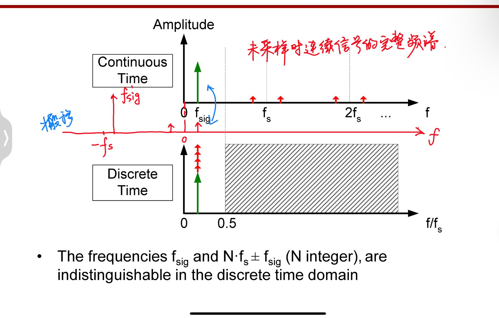

<center style="color:#C0C0C0">Figure 1. Murmann EE315B-Chapter2 page8</center>


## 2. 连续时间信号的离散化处理

实际上这个问题就是$x(t)->x(nT_s)=x[n]$的离散化过程中, 谱分析使用的自变量是怎么变化的, 以及如何去理解这种变化. 设$x_c(t)$和$x_d[n]$分别为连续信号和采样后的离散信号, $x_p(t)$为$x_c(t)$的冲激采样. 因为$x_p(t)$除了$t=nT_s$处是高度等于$x(nT_s)$的冲激, 其他地方都是0, 所以傅里叶变换的积分结果等于
$$
X_p(j\omega)=\sum^{+\infty}_{n=-\infty}x_c(nT_s)e^{-j\omega nT_s}
$$
离散信号$x[n]$的离散时间傅里叶变换(DTFT)等于
$$
\begin{align}
X_d(e^{j\Omega})&=\sum^{+\infty}_{n=-\infty}x_d[n]e^{-j\Omega n}\\
&=\sum^{+\infty}_{n=-\infty}x_c(nT_s)e^{-j\Omega n}
\end{align}
$$
所以
$$
\begin{align}
X_d(e^{j\Omega})&=X_p(j(\frac{\Omega}{T_s}))=\frac{1}{T_s}\sum^{+\infty}_{k=-\infty}X(j(\frac{\Omega}{T_s}-k\omega_s))\\
&=\frac{1}{T_s}\sum^{+\infty}_{k=-\infty}X(j(\frac{\Omega-2\pi k}{T_s}))
\end{align}
$$
观察上面这个式子, 有几个重要且直观的性质: 

1. $x(nT_s)->x[n]$的离散化, 可以看成从由T, 2T, 3T, ... , nTs到1, 2, 3, ... , n的归一化, 把采样时间归一化了, 即在时间域上将信号长度压缩了$T_s$倍, 频域应该拉伸$T_s$倍. 直觉上, $x(t)$的冲激采样的FT和$x[n]$的DTFT很相似: 它们都是只在某些点处有信号, 频谱都是周期性的. **上面的式子正说明了它们的频谱的区别只是横轴和纵轴上的伸缩.** $X_p(j\omega)$中本身$X(j\omega)$频谱的间隔为$\omega_s=2\pi/T_s$, 频域上拉伸$T_s$倍之后, $X_d(e^{j\Omega})=X_p(j(\frac{\Omega}{T_s}))$中$X(j\Omega)$频谱之间的间隔变为$\omega_s\cdot T_s=2\pi$, 正好与DTFT的$2\pi$周期性相吻合.

2. 信号处理时更常见的情况是使用频率而不是角频率作为谱分析的单位, 重新将$X_d(e^{j2\pi f})$写为下面的形式:
    $$
    \begin{align}
    X_d(e^{j2\pi f})&=\frac{1}{T_s}\sum^{+\infty}_{k=-\infty}X(j(\frac{2\pi f-2\pi k}{T_s}))\\
    &=\frac{1}{T_s}\sum^{+\infty}_{k=-\infty}X(j(\frac{2\pi(f-k)}{T_s}))
    \end{align}
    $$
    由于$\omega=2\pi\cdot f$, 以$\omega$作为自变量的谱压缩$2\pi$倍就是以$f$作为自变量的谱. $X_d(e^{j2\pi f})$的周期同样由$2\pi$变为1($X(j\omega)$频谱的间隔等于1). 因为DTFT每个周期表达的谱信息都是完全相同的, 我们考虑$k=0$这个周期. 那么此时**$X_d(e^{j2\pi f})$中的$f$从0变到1, 对应的是$X(j\omega)$中的$\omega$从0变到$\frac{2\pi}{T_s}$, 或$X(j2\pi f)$中的$f$从0变到$f_s$**. 所以虽然DTFT本身不需要具体到"xx $\mu s$"这种时间的概念(它的时间靠点的个数定义), 但点1, 2, 3, ... , n最初是由T, 2T, 3T, ... , nTs时刻的采样结果归一化来的, 那么$X_d(e^{j2\pi f})$中取值范围为$[0, 1]$的$f$就能像上面标粗的那句话所说的一样对应到一个具体的频率($[0,1]->[0,f_s]$). 如果$x_c(t)$是一个实函数, 那么$X(j\omega)$的幅度谱是偶函数, 我们只需要知道DTFT的半个周期, 常见的情况是取$[0,0.5]$作图. 这是为什么论文中常见的频谱图中(如fig1所示)横坐标范围为0至0.5, 且横坐标label为$f/f_s$(如果是单纯的对一列数据进行DTFT, 横坐标label应该为$\Omega$), 比如DTFT横坐标0.25所对应的就是$0.25f_s$频率分量的大小.

    在FFT分析时是同样的道理, 因为FFT是DFT的一种分治算法, DFT可以理解为对DTFT再进行一次频域的采样, 频谱图中横坐标范围同样为0至0.5, 横坐标label为$f/f_s$.

## 3. 带外噪声, 抗混叠滤波器, 过采样与欠采样

欠采样: DTFT的频谱是采样结果的CTFT频谱的伸缩, 形状完全相同. 假设如figure 2所示, 信号不像通常的情况一样处于baseband$[0,f_s/2]$内, 对它进行冲激采样的结果同样是原信号的频谱上下伸缩, 复制, 搬移, 叠加, 最终结果和原信号向左平移$f_s$至带内(也就是通常的Nyquist采样)的采样结果的频谱完全一致! 这个频谱横轴伸缩后就是DTFT的频谱(将采样时间$T_s$归一化为1), 此时离散情形下能分辨出的只有$0\sim f_s/2$的(实)信号. 所以可以利用欠采样将高频带内的信号down fold到baseband. 如果figure 5中的原信号(绿色箭头)的频谱不至于在搬移后发生混叠, 那么欠采样(or 下采样)不会损坏原信号的信息("non-destructive"), 换一种说法, 欠采样的"等效采样频率"也应当满足Nyquist采样定理, 所以figure 5中的Image Reject BPF作用和anti-aliasing filter都是类似的, 都是限制被采样信号的带宽, 防止其他频带的干扰fold到baseband内.

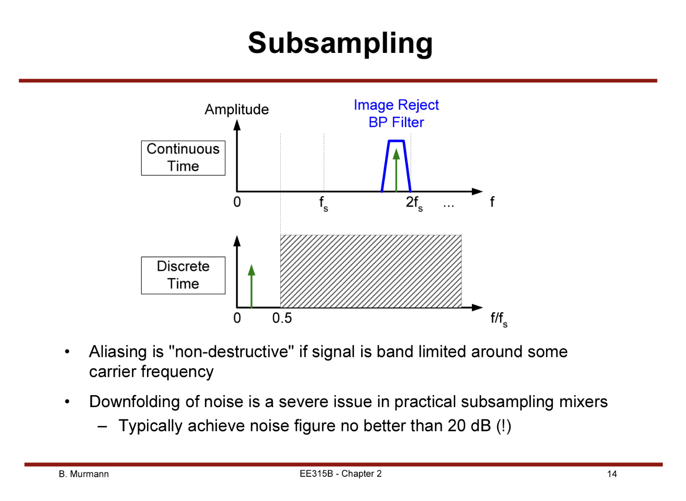

<center style="color:#C0C0C0">Figure 2. Murmann EE315B-Chapter2 page14</center>

关于DTFT只能看到$[0,f_s/2]$的信号, 需要再多说两句. 对于$x(t)$的冲激采样$x_p(t)$, $X_p(j\omega)$是$X(j\omega)$频谱复制搬移叠加的结果, 所有$N\cdot f_s\pm f_{sig}$处的分量都会被混叠到$f_{sig}$处. 但是对$f_{sig}+f_s$, $f_{sig}+2f_s$, ... 别的相差整数倍$f_s$的频率处的分量也统统被混叠到它们上. 对连续信号来说, 由于精度无限大, $f_{sig}+f_s$, $f_{sig}+2f_s$, ...乃至无穷高频上的分量都是确实存在的. 但**对于离散信号, 其频率只能在$f\in [0,1]$取值, 因为离散信号的"采样率"是1**, 频率超出1又回到原点0, $X_d(e^{j\omega})$中$f_{sig}/f_s+1$, $f_{sig}/f_s+2$, ...处的分量大小对离散信号没有意义(相当于baseband的images).

## 4. 信号的重建

采样的结果仅仅告诉我们在$t=n T_s$处信号的真实情况如何, 那么在$t\neq n T_s $时如何恢复信号呢? 这个恢复或重建信号的过程称为插值(interpolation). 

- 理想情况: , 那么对于一个冲激采样后的信号$x_p(t)$, 
    $$
    \begin{gather}
    x_p(t)=x(t)\cdot \sum^{+\infty}_{n=-\infty}\delta(t-nT_s)\\
    x_p(t)\stackrel{\mathscr{F}}{\Longrightarrow}X_p(j\omega)=\frac{1}{2\pi}X(j\omega)* \sum^{+\infty}_{k=-\infty}\frac{2\pi}{T_s}\delta(\omega-k\omega _s)
    \end{gather}
    $$

    $$
    \begin{align}
    \Longleftrightarrow X_p(j2\pi f)&=X(j2\pi f)*\sum^{+\infty}_{k=-\infty}\frac{1}{T_s}\delta(f-kf_s)\\
    &=X(j2\pi f)*\sum^{+\infty}_{k=-\infty}\frac{1}{T_s}\delta(f-\frac{k}{T_s})\\
    &= \frac{1}{T_s}\sum^{+\infty}_{k=-\infty}X(j2\pi(f-\frac{k}{T_s}))
    \end{align}
    $$
    对$x(t)$冲激串采样的频谱结果是$X(j2\pi f)$的上下伸缩, 复制, 平移与叠加.

    如果信号是带限的并且满足Nyquist采样定理($X(j2\pi f)$的replicas不重叠), 完全无损重建信号只需要一个单边带宽为$f_s/2(f_{sig}<f_s/2)$的理想滤波器将目标频带的信号保留, 其他频带的images滤掉. 这个理想滤波器的单位冲激响应为
    $$
    h(t)=\frac{\sin(\pi f_s t)}{\pi f_s t}
    $$
    所以
    $$
    X(j2\pi f)=X_p(j2\pi f)\cdot H(j2\pi f) \Longrightarrow x(t)=x_p(t)*h(t)\\
    x_p(t)=\sum^{+\infty}_{n=-\infty}x(nT_s)\delta(t-nT_s)=\sum^{+\infty}_{n=-\infty}x[n]\delta(t-nT_s)\\
    \begin{align}
    \Longrightarrow x(t)&=\sum^{+\infty}_{n=-\infty}x[n]h(t-nT_s)\\
    &=\sum^{+\infty}_{n=-\infty}x[n]\frac{\sin(\pi f_s( t-nT_s))}{\pi f_s (t-nT_s)}
    \end{align}
    $$
    插值结果实质上是$h(t)$的加权平移叠加($x_p(t)$和$h(t)$的卷积).

- 常见的实际情况: 零阶保持(zero order hold), 将采样得到的信号保持$T_s$或只保持部分$T_s$. 这时重建的信号与原信号相比, 频谱有什么变化 ?**零阶保持可以等效为冲激采样之后再紧跟一个具有矩形单位冲激响应的系统$H_0(j2\pi f)$, 其单位冲激响应$h_0(t)=1, 0\leq t\leq T_{hold},0< T_{hold}\leq T_s$(意思是说, 在每个采样点高度为$x(nT_s)$的冲激信号都作为$H_0(j2\pi f)$的输入, 以$t=nT_s$为local的原点产生$x(nT_s)\cdot h_0(t)$的冲激响应, 即一个左边位于$t=nT_s$, 宽度为$T_{hold}$, 高度为冲激信号高度$x(nT_s)$的矩形, 这也是卷积的物理意义).** 那么零阶保持的结果的时域响应是$x_p(t)$和$h_0(t)$的卷积, 频域是$X_p(j2\pi f)$和$H_0(j2\pi f)$的乘积:
    $$
    \begin{align}
    X_p^{'}(j2\pi f)&=X_p(j2\pi f)\cdot H_0(j2\pi f)\\
    &=\frac{1}{T_s}\sum^{+\infty}_{k=-\infty}X(j2\pi(f-\frac{k}{T_s}))\cdot T_{hold}\frac{\sin(\pi f T_{hold})}{\pi f T_{hold}}e^{-j2\pi f\frac{T_{hold}}{2}}\\
    &=\frac{T_{hold}}{T_s}\frac{\sin(\pi f T_{hold})}{\pi f T_{hold}}e^{-j\pi fT_{hold}}\cdot\sum^{+\infty}_{k=-\infty}X(j2\pi(f-\frac{k}{T_s}))
    \end{align}
    $$

    零阶保持结果的频谱结果可以分为两部分: 后半部分是冲激列采样得到的复制, 平移, 叠加的频谱, 求和符号之前的$sinc(\pi fT_{hold})$部分是无穷多个$X(j2\pi f)$的replicas的包络(这里将$X_p(j2\pi f)$的系数$1/T_s$移到了包络部分中, 不影响理解). 所以本质上零阶保持是将理想情况下通带和阻带转换非常陡峭的理想滤波器换成了一个$sinc$函数, 这个$sinc$函数在transition band有限的下降速度和阻带的纹波使得重建结果偏离理想情况.
    
    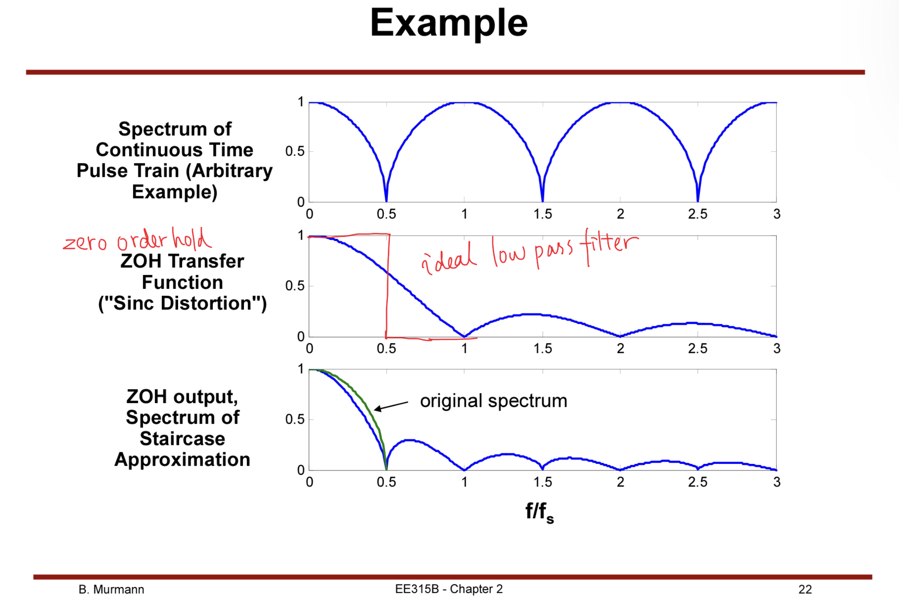
    
    <center style="color:#C0C0C0">Figure 3. Murmann EE315B-Chapter2 page22 该图中的f/fs和第二节中所说的f/fs并不一样,这里是CTFT</center>
    
    零阶保持会引入高频distortion(从时域波形也可以直观看出, 两个采样点之间的dc level切换会引入高频信号), 并且在主瓣($0\leq f\leq f_s/2$)内由于$sinc$的幅度在下降, baseband内也会引入distortion, 因为接近$f_s/2$处$sinc$幅度下降最多, 频率位于此处的信号的distortion比较严重. 为了解决这个问题, 可以在零阶保持之后再加上一个平滑滤波器(smoothing filter, or reconstruction filter), 滤掉高频已经被$sinc$函数shaping一次后的$X(j2\pi f)$ replicas, 同时baseband内部可以给$sinc$逐渐下降的幅度做一些补偿.
    
    对比一下anti-aliasing filter, anti-aliasing filter和smoothing filter的设计要求是差不多的, 都是把baseband之外的信号尽量滤掉, 但anti-aliasing filter是为了防止采样后生成一堆$X(j2\pi f)$的replicas的高频部分折叠到baseband(生成一堆$X(j2\pi f)$的replicas本身没有问题, 有问题的是被采样的信号包含频率大于$f_s/2$的高频干扰, 不满足Nyquist采样定理, 高频部分折叠到baseband); 
    
    而smoothing filter是为了滤掉零阶保持$H_0(j2\pi f)$的$sinc$函数shaping过的$X(j2\pi f)$高频replicas, 滤掉高频信号在时域的效果就是波形的阶梯看起来更平滑, 更解近原信号.
    
    过采样能帮助减小anti-aliasing和smoothing filter的阶数, 很好理解, 因为$f_s/f_{sig}$越大, $f_{sig}$到$f_s/2$就有更多的空间可以用于filter的transition band, roll-off的要求可以减轻.

## 5. 量化噪声的能量和频谱

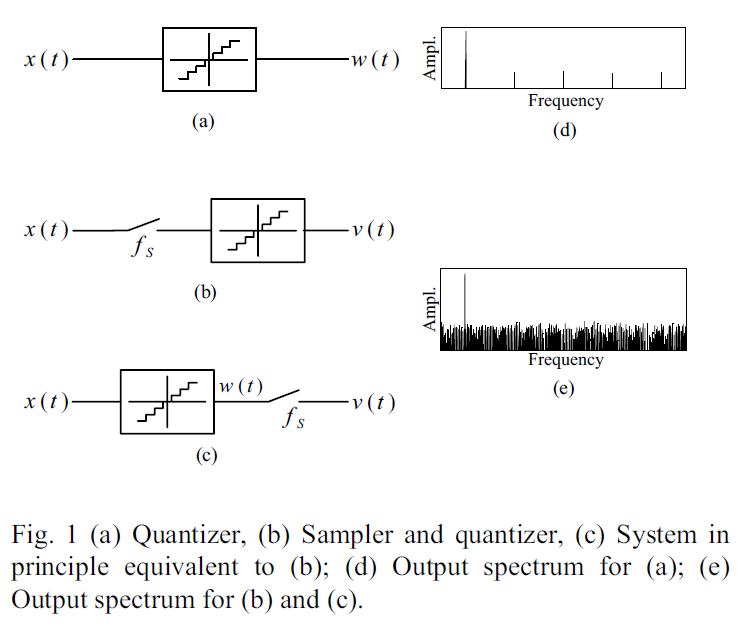

<center style="color:#C0C0C0">Figure 4. Y. Tsividis, ICASSP 2004</center>

考虑这样一个例子: 一个理想正弦信号$x(t)$经过一个QTZ, 输出量化后的信号$w(t)$. 由于$x(t)$是周期的, 所以
$$
w(t+T)=QTZ(x(t+T))=QTZ(x(t))=w(t)
$$
$w(t)$一定是周期的. 但QTZ会引入很多非线性成分, 因此$w(t)$的频谱相比$x(t)$会产生无数个位于$mf_{sig}$的谐波(Figure 3 (d)). 之后再对$w(t)$进行一次采样(Figure 3 (c)), 得到$v(t)$. 我们可以暂时设想这是一个理想冲激串采样, 那么采样结果将是Figure 3 (c)中的频谱复制移动粘贴无数份的样子, 周期为$f_s$ (again, 对实信号只用考虑$0\sim f_s/2$范围). 所以谐波信号被混叠到$\pm f_s \pm mf_{sig}$. 对这种混叠进行一下简单的分析, 假设上述信号被混叠到baseband$[0,f_s/2]$内$f_x$频率上,
$$
\begin{gather}
\pm mf_{sig}\pm pf_s=f_x\\
\pm m\frac{f_{sig}}{f_s}\pm p=\frac{f_x}{f_s}\in[0,\frac{1}{2}]
\end{gather}
$$
$m$和$p$应取适当的值使得${f_x}/{f_s}$落在带内. 如果${f_{sig}}/{f_s}$是有理数, 那么${f_x}/{f_s}$也是有理数, 因此${f_x}/{f_s}$一定在$[0, \frac{1}{2}]$内取离散值, 所以figure 3(c)所示的频谱是离散的. 由于全部谐波的一半都会混叠到$[0,f_s/2]$ (另一半混叠到$[-f_s/2,0]$, 并且$[f_s/2, 3f_s/2],[3f_s/2, 5f_s/2]$等频带以完全相同的方式混叠, 因为冲激串采样的频谱的周期是$f_s$), 这些混叠过来的谐波近似形成了均匀的频谱. 把理想冲激串采样替换为零阶保持采样(保持时间为$T_s$), 即对无穷延拓的频谱进行$sinc$函数shaping, 但我们只关注$[0,f_s/2]$以内的频谱信息, 所以这种shaping没有特别显著的影响.

对于零阶保持, 交换一下采样和量化的顺序并不会改变结果, 因为无论先后顺序, 最终只看采样点那个时间点的信号落到哪个量化区间, 而零阶保持在采样前后不会改变采样点时刻的信号大小. 所以上面对谐波混叠形成的近似均匀频谱的分析也适用于先采样后量化的情况, 也就是分析量化噪声的情况. 量化噪声实质上是QTZ非线性造成的量化结果相对原信号的偏移, 那么量化噪声也就是所有谐波能量之和, 而所有谐波能量都被混叠到了baseband, 所以baseband内的能量等于谐波能量(功率)之和, 等于${\Delta^2}/{12}$.

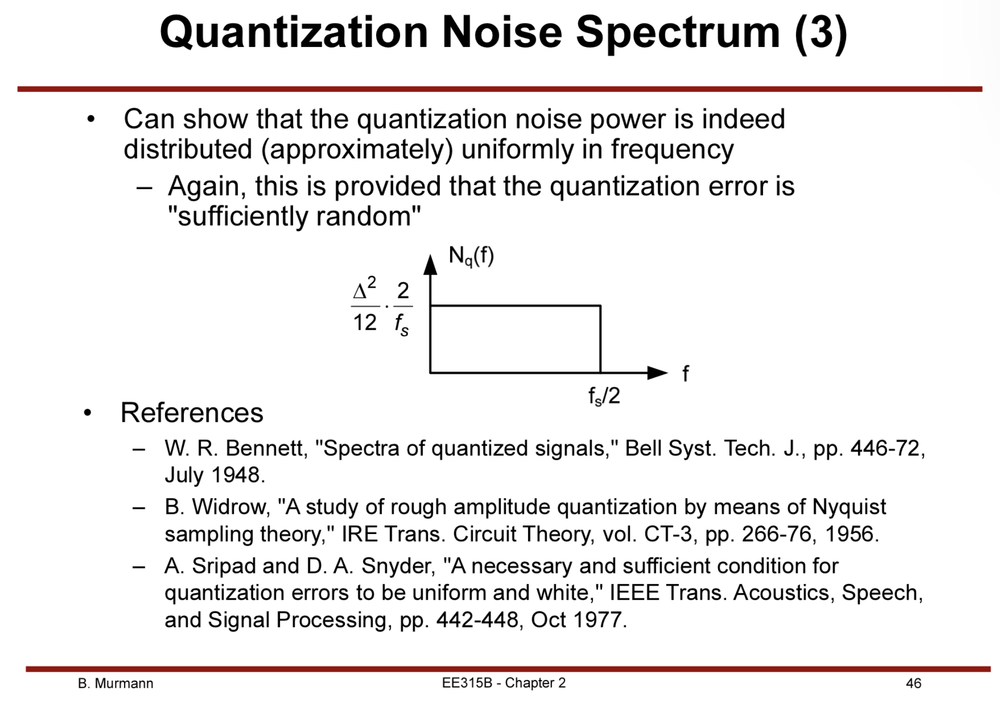

<center style="color:#C0C0C0">Figure 5. Murmann EE315B-Chapter2 page46, Power Spectra of Quantization Noise</center>

既然可以假设量化噪声频谱为白噪声, 且根据上面的分析我们只需要考虑$[0, f_s/2]$内的量化噪声(这里考虑的是单边谱, 左侧$[-f_s/2,0]$部分的噪声功率需要折算到右边), 量化噪声的功率谱密度如figure 5所示, 其功率谱密度为常数$\frac{\Delta^2}{12} \cdot \frac{2}{f_s}$, 如果考虑的是双边功率谱密度, 则$N_q(f)=\frac{\Delta^2}{12} \cdot \frac{1}{f_s},f\in[-f_s/2, f_s/2]$.

## 6. 离散傅里叶变换和快速傅里叶变换

数字域的频谱分析需要一种discrete的时频变换方法. DTFT不符合要求, 因为虽然时域是离散的, DTFT的频谱却是连续的(回忆一下, 由于归一化了时间$T_s$为1, DTFT的频谱仅仅是原信号冲激串采样结果的CTFT频谱的伸缩, 形状不变), 计算机处理不便. 因此, 一种时域输入和频谱输出都离散的频谱分析方法非常有必要. 很显然, 离散时间傅里叶级数就是这样一种频谱分析方法: 从原信号的采样结果连续选择N个点作为输入时域信号, 输出N个傅里叶系数(这里隐含将这N个点扩展为$T=N$的周期信号). 给这种频谱分析方法另起一个名字: 离散傅里叶变换(Discrete Fourier Transform, DFT). 区别于DTFT(Discrete Time Fourier Transform), DTFT时域离散, 频域连续, 而DFT时域频域都离散. 比较严格的定义如下: 设$x[n]$是一有限长信号, 即在$0\leq n \le N_0-1$以外有$x[n]=0$. 可以利用$x[n]$构造一个周期信号$\hat{x}[n]$, 周期$N\ge N_0$, 使得$\hat{x}[n]=x[n],0\le n\le N-1$. 所以$\hat x[n]$的傅里叶级数为
$$
\begin{align}
a_k&=\frac{1}{N}\sum_{n=<N>}\hat x[n]e^{-j2\pi kn/N}\\
&=\frac{1}{N}\sum_{n=0}^{N-1} x[n]e^{-j2\pi kn/N}
\end{align}
$$
上式定义的离散时间傅里叶级数就是$x[n]$的离散傅里叶变换. 一般会将前面的系数$1/N$去掉, 写成
$$
X[k]=\sum_{n=0}^{N-1} x[n]e^{-j2\pi kn/N},\qquad k=0,1,\cdots,N-1
$$
和离散傅里叶级数同理, DFT的反变换为
$$
x[n]=\frac{1}{N}\sum_{k=0}^{N-1} X[k]e^{j2\pi kn/N},\qquad n=0,1,\cdots,N-1
$$
i.e. 有限长的信号(长度为N) $x[n]$可以由它的具有N个值的DFT完全还原(我们可以照搬离散时间傅里叶级数DTFS的全部内容). 离散时间傅里叶级数(或DFT)还有个很重要的性质, 就是DFT和DTFT的关系. 对比一下下面这两个分别代表DTFT和DFT的公式, DTFT:
$$
\begin{align}
X(e^{j2\pi f})&=\sum^{+\infty}_{n=-\infty}x[n]e^{-j2\pi f n}\\
&=\sum^{N-1}_{n=0}x[n]e^{-j2\pi f n},\quad x[n]=0 \ when\  n<0\ or\ n\geq N
\end{align}
$$
DFT:
$$
X[k]=\sum_{n=0}^{N-1} x[n]e^{-j2\pi kn/N},\qquad k=0,1,...,N-1
$$
所以$X[k]=X(e^{j2\pi(\frac{k}{N})})$, 这意味着**DFT实质上是对$x[n]$的DTFT频谱进行一次采样的结果, 以$1/N$为间隔均匀采样$N$个点, 正好对应$X(e^{j2\pi f})$的一个周期($X(e^{j2\pi f})=X(e^{j2\pi (f+1)}),T=1$)**. 这也和离散时间傅里叶级数的周期性对应: $k$只要取任意连续的$N$个数$<N>$即可, 对应到$X(e^{j2\pi f})$中, 就是任意取其一个周期进行采样($f=\frac{m}{N}, \frac{m+1}{N},\frac{m+2}{N},\cdots,\frac{m+N-1}{N}$). 因为选取的区间不同, 频谱会有一些aliasing产生的区别, 但是频谱代表的信息完全相同. 在下一节加窗(Windowing)中, 会通过例子更好地说明"DFT=DTFT的采样"这样一种关系, 并利用这个视角帮助我们直观理解为什么会发生频谱泄漏.

DFT之所以如此重要, 除了它的离散的特点, 还因为一个用于计算DFT的著名算法: 快速傅里叶变换(Fast Fourier Transform, FFT). 为了更好地理解这种算法, 我们把DFT的公式换一种形式表达: 
$$
\begin{bmatrix}
X[0]\\
X[1]\\
X[2]\\
\vdots \\
X[N-1]
\end{bmatrix}
=
\begin{bmatrix}
1& 1& 1& \cdots& 1\\
1& e^{-j2\pi\cdot\textcolor{blue} 1 \cdot \textcolor{red}1/N}& e^{-j2\pi \cdot \textcolor{blue}1\cdot \textcolor{red}{2}/N}& \cdots& e^{-j2\pi\cdot \textcolor{blue}1\cdot\textcolor{red}{(N-1)}/N}\\
1& e^{-j2\pi\cdot\textcolor{blue} 2 \cdot \textcolor{red}1/N}& e^{-j2\pi \cdot \textcolor{blue}2\cdot \textcolor{red}{2}/N}& \cdots& e^{-j2\pi\cdot \textcolor{blue}2\cdot\textcolor{red}{(N-1)}/N}\\
\vdots& \vdots& \vdots& \ddots& \vdots\\
1& e^{-j2\pi\cdot\textcolor{blue}{(N-1)} \cdot \textcolor{red}1/N}& e^{-j2\pi \cdot \textcolor{blue}{(N-1)}\cdot \textcolor{red}{2}/N}& \cdots& e^{-j2\pi\cdot \textcolor{blue}{(N-1)}\cdot\textcolor{red}{(N-1)}/N}
\end{bmatrix}
\begin{bmatrix}
x[0]\\
x[1]\\
x[2]\\
\vdots \\
x[N-1]
\end{bmatrix}
$$
这个$N\times N$的矩阵我们记为$W_N$, $W_N$中的红色数字代表DFT正变换公式中的$n$, 蓝色数字代表$k$. 题外话, 矩阵$W_N$及其转置都是一个范德蒙矩阵, 并且通过IDFT很容易知道$W_N$的逆为
$$
W_N^{-1}=
\frac{1}{N}
\begin{bmatrix}
1& 1& 1& \cdots& 1\\
1& e^{j2\pi\cdot\textcolor{blue} 1 \cdot \textcolor{red}1/N}& e^{j2\pi \cdot \textcolor{blue}2\cdot \textcolor{red}{1}/N}& \cdots& e^{j2\pi\cdot \textcolor{blue}{(N-1)}\cdot\textcolor{red}{1}/N}\\
1& e^{j2\pi\cdot\textcolor{blue} 1 \cdot \textcolor{red}2/N}& e^{j2\pi \cdot \textcolor{blue}2\cdot \textcolor{red}{2}/N}& \cdots& e^{j2\pi\cdot \textcolor{blue}{(N-1)}\cdot\textcolor{red}{2}/N}\\
\vdots& \vdots& \vdots& \ddots& \vdots\\
1& e^{j2\pi\cdot\textcolor{blue}{1} \cdot \textcolor{red}{(N-1)}/N}& e^{j2\pi \cdot \textcolor{blue}{2}\cdot \textcolor{red}{(N-1)}/N}& \cdots& e^{j2\pi\cdot \textcolor{blue}{(N-1)}\cdot\textcolor{red}{(N-1)}/N}
\end{bmatrix}
$$
非常漂亮的结果.

从矩阵的线性变换的角度看, 如果已知$N$, 那么$W$的每一个元素都是都是可以提前算好并存在计算机里的, 由矩阵乘法直接计算$N$个$X[k]$值将消耗$N^2$次复数乘法和$N^2$次复数加法, 复杂度$O(N^2)$. 

假设$N$是偶数, 令$f[n]=x[2n]$表示$x[n]$的第偶数个样本, $g[n]=x[2n+1]$表示$x[n]$的第奇数个样本, 那么$f[n]$和$g[n]$在区间$0\leq n \leq N/2-1$之外等于0. 接下来将DFT正变换的公式利用$f[n]$和$g[n]$拆成偶数下标样本和奇数下标样本两部分
$$
\begin{align}
X[k]&=\sum_{n=0}^{N-1}x[n]W_N(k,n)\\
&=\sum_{n=0}^{N/2-1}f[n]W_N({k,2n})+\sum_{n=0}^{N/2-1}g[n]W_N({k,2n+1})\\
&= \sum_{n=0}^{N/2-1}f[n]W_N({k,2n})+W_N({k,1})\sum_{n=0}^{N/2-1}g[n]W_N({k,2n})
\end{align}
$$
其中$W_N(i,j)$代表位于矩阵$W_N$的第$i+1$行, 第$j+1$列的元素. 通过观察可以发现$W_N$和$W_{\frac{N}{2}}$(我们已经假设了$N$为偶数)的元素存在下面的关系:

$$
\begin{align}
W_{N}({\textcolor{blue}{k},\textcolor{red}{2n}})&=e^{-j2\pi \textcolor{blue}k\cdot\textcolor{red}{2n}/N}\\
&=e^{-j2\pi \textcolor{blue}k\cdot \textcolor{red}{n}/\textcolor{green}{(N/2)}}\\
&=W_{{\textcolor{green}{\frac{N}{2}}}}(\textcolor{blue}k,\textcolor{red}{n})
\end{align}
$$

所以$X[k]$可以写成
$$
\begin{align}
X[k]
&= \sum_{n=0}^{N/2-1}f[n]W_{\frac{N}{2}}(k,{n})+W_N({k,1})\sum_{n=0}^{N/2-1}g[n]W_{\frac{N}{2}}(k,{n})\\
&=DFT(f[n])+W_N(k,1)\cdot DFT(g[n])\\
&=DFT(x[n])
\end{align}
$$
这样, 我们就把长度为$N$的序列的DFT分解为了两个长度为$N/2$的序列的DFT, 以上就是FFT**分治**的核心思想. 经过一次分解, 计算$N$个DFT值所需要的复数乘法次数由$N^2$变为$2\cdot (\frac{N}{2})^2=N^2/2$. 如果$N$是2的整数次幂, 可以一直这样分解下去直到$N=1$($X[0]=x[0]$). 假设FFT的复杂度为$T(N)$, 根据递归关系$T(N)=2\cdot T(\frac{N}{2})+O(N)$和算法时间复杂度分析的主定理, $T(N)=O(Nlog(N))$. 

## 7. 频谱泄漏(Spectral Leakage)和加窗(Windowing)

### 加窗

回忆一下上一节我们对于DFT和DTFT之间关系的论述: **DFT实质上是对$x[n](0\leq n \leq N)$的DTFT频谱进行一次采样的结果**, 这里的DTFT比较特殊, 是对被截断的信号进行DTFT, 即上一节推导中
$$
\begin{align}
X(e^{j2\pi f})&=\sum^{+\infty}_{n=-\infty}x[n]e^{-j2\pi f n}\\
&=\sum^{N-1}_{n=0}x[n]e^{-j2\pi f n},\quad x[n]=0 \ when\  n<0\ or\ n\geq N
\end{align}
$$
的由来. 本来DTFT应该对$n=-\infty$到$n=+\infty$无穷长的信号序列进行变换, 但现实中这不可能做到, 所以只能截取实际信号的一部分处理, 设无穷长的信号序列为$x_0[n]$, 截取它的一个窗口$x[n]$的操作可以表示为
$$
x[n]=x_0[n]\cdot p[n]\\
p[n]=\left\{
\begin{array}{rcl}
1, & {0\leq n \leq N-1}\\
0, & {n<0\ or \ n\geq N}
\end{array}
\right.
$$
$p[n]$称为窗函数. 这样我们就可以通过$x_0[n]$和$p[n]$的DTFT求出$x[n]$的DTFT, 进而通过一次采样求出$x[n]$的DFT. 当然$p[n]$并不非得是矩形窗, 接下来将会以上式的矩形窗为例子, 讨论不同窗函数到底会对DTFT和DFT的频谱造成什么影响, 以及我们为什么要取除了矩形窗之外其他形式的窗函数.

根据DTFT的时域相乘性质
$$
X(e^{j2\pi f})=\int_1 X_0(e^{j2\pi \theta})\cdot P(e^{j2\pi (f-\theta)})d\theta
$$
这是一个周期卷积, $\theta$的取值范围为一个长度为1的区间. 将卷积范围设定为$[-1/2,1/2]$, 并令
$$
\hat{X_0}(j2\pi f)=\left\{
\begin{array}{rcl}
&{X_0}(j2\pi f)&, & -\frac{1}{2}\leq n \leq \frac{1}{2}\\
&0 &, & n<-\frac{1}{2}\ or \ n>\frac{1}{2}
\end{array}
\right.
$$
(即只截取${X_0}(j2\pi f)$的一个周期) 则周期卷积可以化为标准的卷积: 
$$
\begin{align}
X(e^{j2\pi f})&=\int_{-\infty}^{+\infty} \hat{X_0}(e^{j2\pi \theta})\cdot P(e^{j2\pi (f-\theta)})d\theta\\
&=\hat{X_0}(e^{j2\pi \theta})*P(e^{j2\pi \theta})
\end{align}
$$
如示意图, 因为$X_0(e^{j2\pi f})$只取了一个周期, 但$P(e^{j2\pi f})$的无穷多个周期全部保留, 卷积的时候把$P(e^{j2\pi f})$的周期都拆开来考虑, $P(e^{j2\pi f})=\cdots+P_{-1}(e^{j2\pi f})+P_{0}(e^{j2\pi f})+P_{1}(e^{j2\pi f})+\cdots$, $P_{0}(e^{j2\pi f})$表示$[-1/2,1/2]$周期内的那一部分$P(e^{j2\pi f})$, $P_i(e^{j2\pi f})$项表示将$P_0(e^{j2\pi f})$平移$i\cdot T=i\cdot 1$距离, $i$为正向右平移, 反之向左平移(就是将 $P_{0}(e^{j2\pi f})$复制平移粘贴). 根据卷积的性质, 
$$
\begin{align}
\hat{X_0}(e^{j2\pi \theta})*P_{i}(e^{j2\pi f})&=\hat{X_0}(e^{j2\pi \theta})*[P_{0}(e^{j2\pi f})*\delta(f-i)]\\
&=[\hat{X_0}(e^{j2\pi \theta})*P_{0}(e^{j2\pi f})]*\delta(f-i)
\end{align}
$$
上面这个式子的意思是, $\hat{X_0}(e^{j2\pi \theta})$和${P_i}(e^{j2\pi \theta})$的卷积结果等于$\hat{X_0}(e^{j2\pi \theta})$和${P_0}(e^{j2\pi \theta})$的卷积结果平移距离$i\cdot 1$, 所以$\hat{X_0}(e^{j2\pi \theta})*P(e^{j2\pi \theta})$的卷积结果也是$\hat{X_0}(e^{j2\pi \theta})*{P_0}(e^{j2\pi \theta})$图像的复制平移粘贴, 相邻图像平移间距为1, 即DTFT的周期. 这再次验证了DTFT的周期为1, 也验证了无论周期卷积中自变量$\theta$取哪个长度为1的区间, 卷积结果都一样, 这揭示了所谓的"周期卷积"的意义, 一切都源自于离散傅里叶变换中频谱的周期性.

搞清楚了$X(e^{j2\pi f})=\int_1 X_0(e^{j2\pi \theta})\cdot P(e^{j2\pi (f-\theta)})d\theta$周期卷积的意义, 我们就可以着手计算$X(e^{j2\pi f})$到底长什么样了. 以正弦信号$x_0[n]$为例, 首先计算$P(e^{j2\pi f})$. 
$$
\begin{align}
P(e^{j2\pi f})&=\sum_{k=0}^{N-1}p[k]\cdot e^{-j2\pi fk}\\
&=\sum_{k=0}^{N-1}e^{-j2\pi fk}\\
&= \frac{1-e^{-j2\pi f N}}{1-e^{-j2\pi f}}\\
&= \frac{e^{-j\pi fN}(e^{j\pi fN}-e^{-j\pi fN})}{e^{-j\pi f}(e^{j\pi f}-e^{-j\pi f})}\\
&=\frac{\sin(2\pi fN/2)}{\sin(2\pi f/2)}\cdot e^{-j2\pi f(N-1)/2}
\end{align}
$$
其中$\frac{\sin(2\pi fN/2)}{\sin(2\pi f/2)}=\frac{\sin(\omega N/2)}{\sin(\omega/2)}$称为Dirichlet Form, $N $代表窗口的长度, 它的峰值为$N$. 同时上述DTFT结果也可以看成$N$点running sum离散系统的传递函数, 因为窗函数也是running sum的冲激响应. 

---

### 似曾相识的$P(e^{j2\pi f})$

$P(e^{j2\pi f})$的DTFT是Dirichlet Form再乘上一个相位因子$e^{-j2\pi f(N-1)/2}$, 这是否很像离散时间傅里叶变换的时域平移性质呢? 如果$N$是奇数, $0 \sim N$的矩形窗可以看成窗口占据$-\frac{N-1}{2}\sim\frac{N-1}{2}$的关于纵轴轴对称的矩形窗向右平移$\frac{N-1}{2}$得到, 可以很直接的从轴对称的矩形窗的DTFT和时域平移性质得出. 但如果$N$是偶数, 似乎解释不通? 因为离散信号没法平移"0.5个单位".

为了解决"离散信号平移0.5个单位"的矛盾, 我们可以先把问题放到连续时间域下看待. 首先, 我们把$n=0\sim N$, 高度为1的离散时间域的矩形窗替换成连续时间域的冲激信号串, 即$n=1, 2, 3,...$替换成$t=T_s, 2T_s, 3T_s,\cdots$的坐标, 并把每个点替换成对应高度的冲激信号. 根据第2节的内容, 离散信号和对应的连续时间域冲激信号的傅里叶变换相比只是水平伸缩了一下:
$$
X_d(e^{j\Omega})=X_{p1}(j(\frac{\Omega}{T_s}))
$$
这时候把$x_{p1}(t)$向左平移$\frac{N-1}{2}$, 得到轴对称的矩形窗, 它的CTFT就是标准的Dirichlet Form再经历一次水平伸缩:
$$
\begin{align}
X_{p2}(j2\pi f)&=\int^{+\infty}_{-\infty}x_{p2}(t)e^{-j2\pi ft}dt   \\
&= \sum^{(N-2)/{2}}_{i=-N/2}e^{-j2\pi f(\frac{1}{2}+i)T_s}\\
&= e^{j2\pi f\frac{N-1}{2}T_s}\frac{e^{-j2\pi fNT_s}-1}{e^{-j2\pi fT_s}-1}\\
&=\frac{\sin(2\pi fT_sN/2)}{\sin(2\pi fT_s/2)}
\end{align}
$$
把$x_{p2}(t)$平移回$x_{p1}(t)$的位置, 那么连续时间傅里叶变换的时域平移告诉我们
$$
\begin{align}
X_{p1}(j2\pi f)&=X_{p2}(j2\pi f)\cdot e^{-j2\pi f\cdot \frac{N-1}{2}T_s}\\
&=\frac{\sin(2\pi fT_sN/2)}{\sin(2\pi fT_s/2)}\cdot e^{-j2\pi f\cdot \frac{N-1}{2}T_s}
\end{align}
$$
再次运用第2节的内容, 离散信号$x[n]$和对应的连续时间域冲激信号$x_{p1}(t)$的傅里叶变换相比只是水平伸缩了一下, 所以
$$
X_d(e^{j2\pi f})=\frac{\sin(2\pi fN/2)}{\sin(2\pi f/2)}\cdot e^{-j2\pi f(N-1)/2}
$$
注意这里我们没有用到DTFT时域平移的性质, 而是CTFT时域平移的性质: $x_{p1}(t)$相比$x_{p2}(t)$平移了$\frac{N-1}{2}T_s$, $T_s$是采样间隔, 这和$N$是奇数还是偶数没有关系.

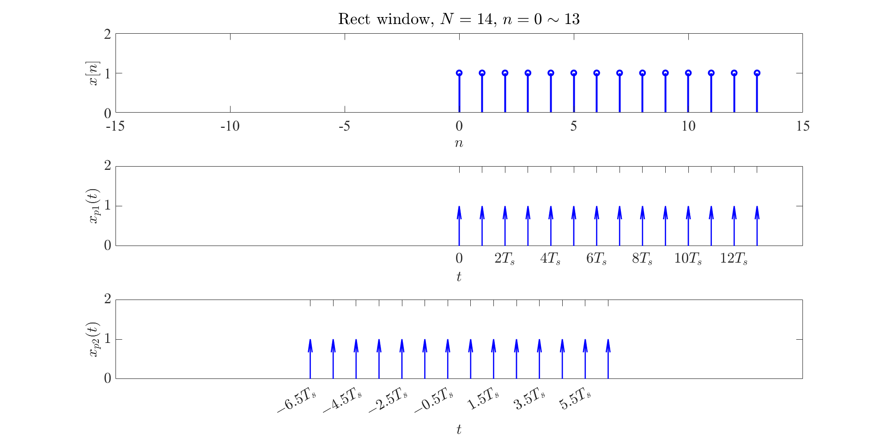

---

回归正题, 对于正弦信号$x_0[n]=\sin(2\pi f_0 n)$, $x_0[n]$的DTFT($\frac{1}{2j}\left[\delta(f-f_0)-\delta(f+f_0) \right]$的复制平移粘贴):
$$
X_0(e^{j2\pi f})=\frac{1}{2j}\sum^{+\infty}_{l=-\infty} \left[\delta(f-f_0-l)-\delta(f+f_0-l) \right]
$$
按照之前的分析计算周期卷积, 只取$X_0(e^{j2\pi f})$的一个周期$\hat{X_0}(e^{j2\pi f})$ (为了方便起见, 假设满足Nyquist采样定理， 并取$[-1/2,1/2]$)和$P(e^{j2\pi f})$做非周期卷积, 即
$$
\begin{align}
\hat{X_0}(e^{j2\pi f})&=\frac{1}{2j}\left[\delta(f-f_0)-\delta(f+f_0) \right]\\
X(e^{j2\pi f})&=\hat{X_0}(e^{j2\pi f})*P(e^{j2\pi f})\\
&=\frac{1}{2j}\left[ P(e^{j2\pi(f-f_0)}) -P(e^{j2\pi(f+f_0)})\right]\\
\end{align}
$$
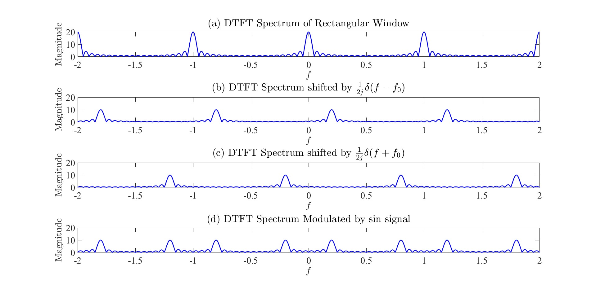

<center style="color:#C0C0C0">Figure 6. 矩形窗的DTFT频谱, 最上方是Dirichlet Form, N=20, f0=0.2</center>

```matlab
% Rect_Windowed_sin_DTFT.m
function DTFT = Rect_Windowed_sin_DTFT(x, N, f0)
arguments 
    x   (1,:)
    N   (1,1)
    f0  (1,1)
end
    DTFT =      (1/2i)*N*diric(2*pi*(x - f0), N) .* (exp(-1i*2*pi*(x - f0)*(N - 1)/2)) ...
            -   (1/2i)*N*diric(2*pi*(x + f0), N) .* (exp(-1i*2*pi*(x + f0)*(N - 1)/2));
end
```

```matlab
close all; clc; clear;
set(groot,'defaultLineLineWidth',2)
set(groot,'DefaultAxesColorOrder',[0 0 1]);
set(groot,'DefaultFigureColor',[1 1 1]);
set(groot,'defaultAxesFontName','Times New Roman')
set(groot,'defaultAxesFontSize',24)
set(groot,'defaultAxesLabelFontSizeMultiplier',1) 
set(groot,'defaultTextInterpreter', 'latex')
% set default plot properties

N = 20;                         % length of rect window
N_x = 100000;                   % size of vector x
f0 = 0.2;                       % sin freq = 0.2*fs
x = linspace(-2, 2, N_x);

P = zeros(4, N_x);
P(1,:) =  N*diric(2*pi*x, N) .* (exp(-1i*2*pi*x*(N - 1)/2));
P(2,:) = (1/2i)*N*diric(2*pi*(x - f0), N) .* (exp(-1i*2*pi*(x - f0)*(N - 1)/2));
P(3,:) = (1/2i)*N*diric(2*pi*(x + f0), N) .* (exp(-1i*2*pi*(x + f0)*(N - 1)/2));
% P4 = P2 - P3;
P(4,:) = Rect_Windowed_sin_DTFT(x, N, f0);

for i = 1:4
    subplot(4, 1, i);
    plot(x, abs(P(i,:)));
    axis([-2 2 0 20]);
    ylabel("Magnitude");
    xlabel("$f$");
    if i == 1
        title("(a) DTFT Spectrum of Rectangular Window");
    elseif i == 2
        title('(b) DTFT Spectrum shifted by $\frac{1}{2j}\delta (f-f_0)$');
    elseif i == 3
        title("(c) DTFT Spectrum shifted by $\frac{1}{2j}\delta (f+f_0)$");
    else
        title("(d) DTFT Spectrum Modulated by sin signal");
    end
end
save Rectangular_Window_DTFT_Spectrum
```


矩形窗的频谱$X(e^{j2\pi f})$如figure 6 (d)所示, 这个例子中设$N=20$, $f_0=0.2$. 因为
$$
x_0[n]=\sin(2\pi f_0 n)=x_0(nT_s)=\sin(2\pi f_{c0} n T_s)=\sin(2\pi \frac{f_{c0}}{f_s}n)
$$
(其中$f_{c0}$指连续时间域的原信号频率, $f_s=1/T_s$为连续时间域的采样频率), 所以实际上$f_0=0.2$对应到原本的连续时间域就是$0.2f_s$, 即这个连续时间的正弦信号频率为$0.2f_s$, 为了统一离散和连续时间域频率的不同表示, figure 6中的横坐标label可以换成$f/f_s$, 正如figure 2 Discrete Time频谱图中所示.

### 频谱泄漏

由上一节推导出的结论$X[k]=X(e^{j2\pi(\frac{k}{N})})$, DFT是对DTFT频谱的一次采样($k$取任意$N$个连续的整数), 我们终于可以得出$\sin$信号的DFT频谱了. 采样结果如figure 7所示. 对于实信号, figure 7中半个周期的频谱都是多余的, 实际操作中一般只展示$[0, 0.5f_s]$部分的频谱. 

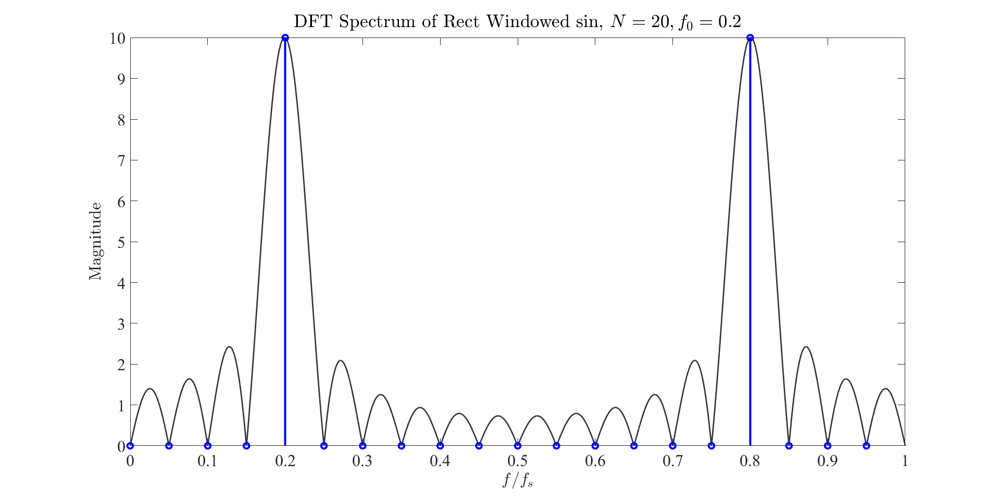

<center style="color:#C0C0C0">Figure 7. 蓝色针状图为矩形窗调制的sin信号的DFT频谱, 灰色的连续谱为figure 5(d)</center>

再仔细分析一下figure 7的频谱, 采样点取在$0,1/N, 2/N, 3/N,\cdots,(N-1)/N$, 只和矩形窗的长度有关, 和被采样的DTFT频谱没有什么关系. 那么如果我们稍微改变一下原信号$x_0(t)=\sin(2\pi f_{c0}t)$的频率会发生什么呢? 如下图所示, $f_0$被改到略偏移0.2的位置. 根据前面的公式推导, 我们知道$\sin[2\pi f_0n]$的DTFT频谱是周期性的冲激函数, 在$[-1/2,1/2]$内两个冲激分别位于$-f_0$和$+f_0$, 这两个冲激和矩形窗函数的Dirichlet Form卷积, 结果是Dirichlet Form左右平移并叠加. 很明显Dirichlet Form的峰被移到了$\pm f_0$附近, 之所以说"附近", 是因为$\sin$函数DTFT频谱的两个冲激会把Dirichlet Form拆成两个纵轴上压缩$1/2$的Dirichlet Form , 并分别往左右移动, 这两个Dirichlet Form加起来之后峰值对应的频率可能略偏移$\pm f_0$, 各自峰值大小也可能略偏移$N/2$, 因为它们各自会受到对方的旁瓣和相位的影响. 某些情况下, 例如取$f_0=k/N$可以使得峰值位置和大小精确等于$f_0$和$N/2$. 当然如果我们用更加特殊的信号$x_0(t)=A\cdot e^{j2\pi f_{c0}t}$重复上面的计算和作图, 就完全不会有峰值位置和大小偏移的问题, 因为复指数信号的DTFT频谱的一个周期内只有一个冲激, 只会整体平移Dirichlet Form, 而不是像$\sin$那样把Dirichlet Form拆成两部分分别左右平移后叠加. 

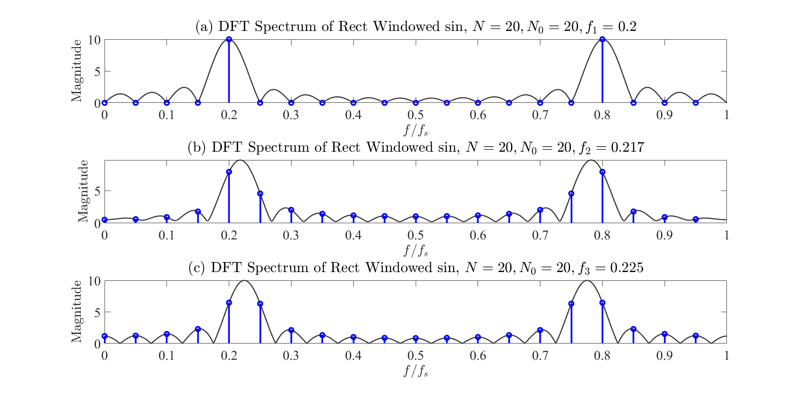

<center style="color:#C0C0C0">Figure 8. 矩形窗调制的sin信号DFT频谱, (b)(c)有频谱泄漏</center>

```matlab
close all; clc; clear;
set(groot,'defaultLineLineWidth',2)
set(groot,'DefaultAxesColorOrder',[0 0 1]);
set(groot,'DefaultFigureColor',[1 1 1]);
set(groot,'defaultAxesFontName','Times New Roman')
set(groot,'defaultAxesFontSize',24)
set(groot,'defaultAxesLabelFontSizeMultiplier',1) 
set(groot,'defaultTextInterpreter', 'latex')
% set default plot properties

N_0 = 20;   % Rect window length
N = 20;     % DFT length (N > N_0 means zero padding exists)
N_x = 100000;
x = linspace(-2, 2, N_x);
k = 0:1/N:1-1/N;
sin_DTFT = zeros(3, N_x);
sin_DFT = zeros(3, N);
f = [0.2, 0.217, 0.225];
for i = 1:3
    sin_DTFT(i,:) = Rect_Windowed_sin_DTFT(x, N_0, f(i));
    sin_DFT(i,:) = Rect_Windowed_sin_DTFT(k, N_0, f(i));
end

ms = 8; % markersize
lw = 3;  % linewidth
%-------------------------------------------
for i = 1:3
    subplot(3, 1, i);
    plot(x, abs(sin_DTFT(i,:)), Color = [0.2 0.2 0.2]);
    hold on;
    axis([0 1 0 inf]);
    ylabel("Magnitude");
    xlabel("$f/f_s$");
    if i == 1
        title("(a) DFT Spectrum of Rect Windowed sin, $N=" + num2str(N) + ", N_0=" + num2str(N_0) + ", f_1=" + num2str(f(1)) + "$");
    elseif i == 2
        title("(b) DFT Spectrum of Rect Windowed sin, $N=" + num2str(N) + ", N_0=" + num2str(N_0) + ", f_2=" + num2str(f(2)) + "$");
    else
        title("(c) DFT Spectrum of Rect Windowed sin, $N=" + num2str(N) + ", N_0=" + num2str(N_0) + ", f_3=" + num2str(f(3)) + "$");
    end
    stem(k, abs(sin_DFT(i,:)), LineWidth = lw, MarkerSize = ms, Color = 'b');
    hold off;
end
```

我们只是稍微改变了一下原信号$x_0(t)$的频率, 其采样和离散化之后的DFT频谱却有着相当大的变化. Figure 8(a)中DFT频谱和我们预计的相符合, 频谱只在原信号$x_0(t)=\sin(2\pi f_{c0}t)$的频率$0.2 f_s$处有一个峰值, 其他频率bin都是0. 但是figure 8(b)(c)却和我们预计的大不相同: (b)图中峰值出现在$0.2f_s$, 而不是原信号的频率$f_2=0.21f_s$, 并且峰旁还有一系列不为零的频谱信号, (c)中则更甚, 直接出现了两个大致相等的峰. 由于矩形窗引入了Dirichlet Form, 正弦信号的DFT频谱才和我们对$\sin$信号频谱的认识相去甚远. 当原信号$x_0(t)$的频率为$kf_s/N$时, Dirichlet Form的峰值和零点恰好落在DFT对DTFT的所有采样点上, DFT的频谱符合直觉且简洁. 但当$x_0(t)$的频率不是$f_s/N$的整数倍时, 平移后的Dirichlet Form的旁瓣被DFT采样, 并且我们看到的峰值出现偏移, 这种现象称为**频谱泄漏(Spectral Leakage)**. 

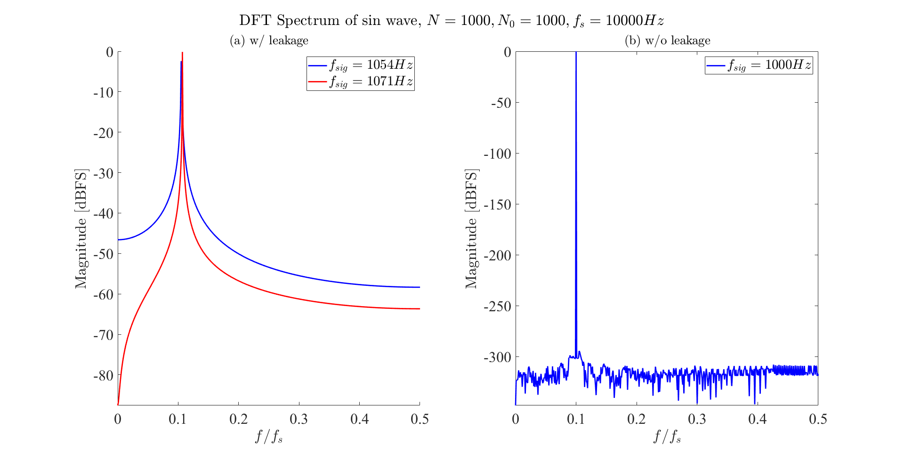

<center style="color:#C0C0C0">Figure 9. 矩形窗调制的sin信号DFT的另外三个例子, 纵坐标为dBFS</center>

```matlab
close all; clc; clear;
set(groot,'defaultLineLineWidth',2)
set(groot,'DefaultAxesColorOrder',[0 0 1;1 0 0;0 1 0;1 1 0;1 1 1]);
set(groot,'DefaultFigureColor',[1 1 1]);
set(groot,'defaultAxesFontName','Times New Roman')
set(groot,'defaultAxesFontSize',24)
set(groot,'defaultAxesLabelFontSizeMultiplier',1) 
set(groot,'defaultTextInterpreter', 'latex')
% set default plot properties

N_0 = 1000; % Rect window length
N = 1000;   % DFT length
k = 0:1/N:1-1/N;
fs = 10000;
fsig = [1054, 1000, 1071];
Amp = 1;
sin_DFT = zeros(3, N);
for i = 1:3
    sin_DFT(i,:) = Amp*Rect_Windowed_sin_DTFT(k, N_0, fsig(i)/fs);
    sin_DFT(i,:) = 20*log10(abs(sin_DFT(i,:)/((N_0/2)*Amp)));
end

subplot(1, 2, 1);
hold on;
axis([0 0.5 -inf 0]);
for i = [1, 3]
    plot(k, sin_DFT(i,:));
end
hold off;
legend("$$f_{sig}=" + num2str(fsig(1)) + "Hz$$", "$$f_{sig}=" + num2str(fsig(3)) + "Hz$$", "interpreter","latex");
ylabel("Magnitude [dBFS]");
xlabel("$f/f_s$");
subtitle("(a) w/ leakage", "fontsize", 20);

subplot(1, 2, 2);
plot(k, sin_DFT(2,:));
axis([0 0.5 -inf inf]);
legend("string", "$$f_{sig}=" + num2str(fsig(2)) + "Hz$$", "interpreter","latex");
ylabel("Magnitude [dBFS]");
xlabel("$f/f_s$");
subtitle("(b) w/o leakage", "fontsize", 20);
sgtitle("DFT Spectrum of sin wave, $N=" + num2str(N) + ", N_0=" + num2str(N_0) + ", f_s=" + num2str(fs) + "Hz$", "interpreter", "latex", "fontsize", 24);
```

Figure 9展示了频谱泄漏的其他一些例子. 只要$f_{sig}\neq kf_s/N$就会发生频谱泄漏, 并且不同频率的正弦信号的带有泄漏的频谱形状也不尽相同, 这和Dirichlet Form具体被平移了多远有关. Figure 9 (b)为无泄漏的正弦信号频谱, 除了序号$k=100$的bin, 其余bin的谱线高度都等于0, 但由于MATLAB的浮点计算精度有限, 频谱图上这些bin的大小看起来像在非常非常小的值附近随机波动. 

自此我们理解了矩形窗处理是如何导致的频谱泄漏. 但上面的分析全部都在频域中, 相应的时域分析对应着什么呢? 因为DFT本质上是离散时间傅里叶级数, 所以我们把长度为$N$的序列送到DFT中, DFT将默认以$N$为周期将序列延拓为周期序列. 那么如果我们送进DFT的序列中不包含整数个正弦周期, 延拓点就会发生非线性, 引入频谱中宽度不为零的主瓣和很多旁瓣. 从时域考虑不发生泄漏的条件, 序列中含有整数个正弦周期, 即
$$
N\cdot T_s = k\cdot T_{sig}\\
f_{sig} = \frac{k}{N}f_s
$$
和我们从频域得到的结论完全一致. 这里的$k$恰好是序列包含的cycle个数.

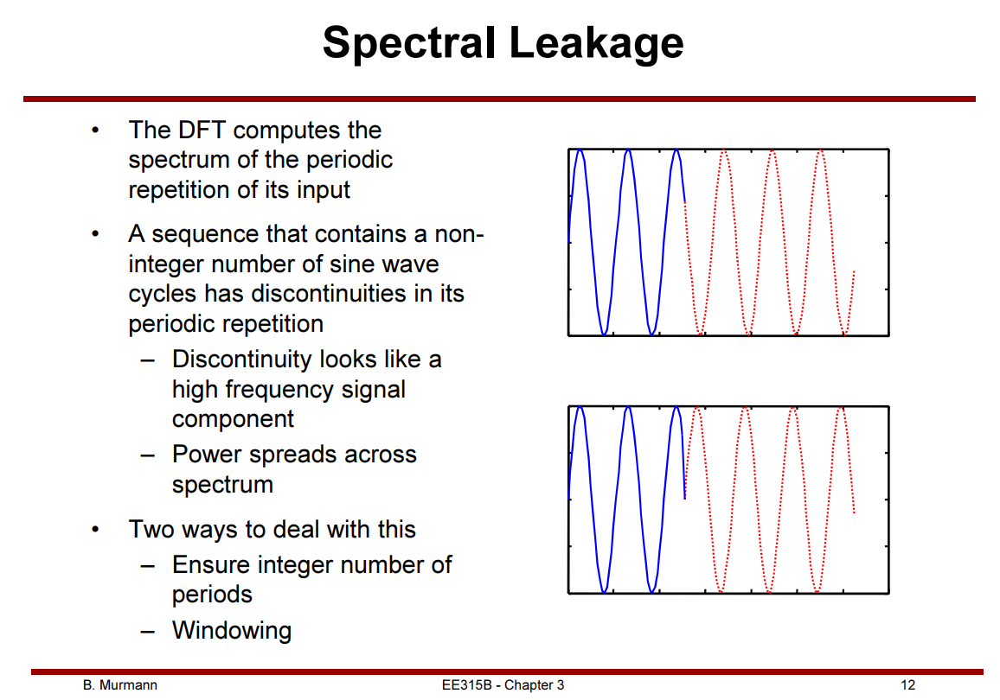

<center style="color:#C0C0C0">Figure 10. Murmann EE315B-Chapter3 page12, Spectral Leakage的时域理解</center>

### 补零(Zero Padding)

有限长度的数字信号处理中有一种方法称为补零(Zero Padding), 即在实际采样到的信号末尾补上一堆0. 让我们来看看补零操作对原信号的DFT频谱有何影响. 首先信号末尾补零并不会改变原信号的DTFT:
$$
\begin{align}
X(e^{j2\pi f})&=\sum^{+\infty}_{n=-\infty}x[n]e^{-j2\pi f n}\\
&=\sum^{N_0-1}_{n=0}x[n]e^{-j2\pi f n},\quad x[n]=0 \ when\  n<0\ or\ n\geq N_0\\
\end{align}\\
$$
其中$N_0$是信号不为0的长度, $N-N_0$是补零的个数. 但是很显然补零会改变DFT, 因为我们之前得出的$X[k]=X(e^{j2\pi(\frac{k}{N})})$, DFT是对DTFT的一次采样, 采样的间隔和点数和送入DFT的信号总长度$N$有关, $N$越大, 对DTFT频谱采样越密集. 尽管我们还是使用原始的信号, 只是单纯在末尾加了一堆没有任何信息的0, 但好像DFT的采样精度更高了? 那么最终的频谱结果会更好吗? 让我们对figure 8中的DFT运用补零的方法 (只需要将figure 8对应代码中的$N$改为大于$N_0$的整数即可):

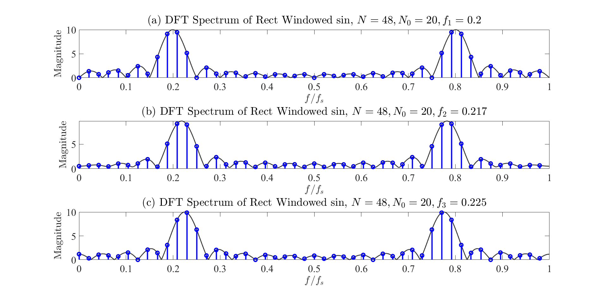

<center style="color:#C0C0C0">Figure 11. 补零后的sin信号DFT频谱</center>

补零之后, 我们可以更精准地判断figure 8 (b)(c)中的峰的位置, 但原本看起来不错的figure 11 (a)也发生了严重的频谱泄漏! 虽然补零能够增大DFT对DTFT的采样精度, 但我们应该记得, 这里的DTFT本身是矩形窗的频谱主导的!! DFT采样越密集, 看到的却是矩形窗的频谱细节, 而不是正弦信号本身的频谱信息. 而且一旦采用补零的方法, 也就不能使所有的采样点落到Dirichlet Form的峰和零点处(因为一个周期内峰和零点总数只有$N_0$个, 一旦$N>N_0$, 肯定会发生频谱泄漏). 作为一种权宜之计, 补零可以更容易确定单频信号峰的位置, 但没有给频谱增加有用的信息, 引入了更多旁瓣, 需要慎重使用.

### 频谱分辨率

以上我们举的所有例子都是针对单频信号的分析, 实际情况肯定没有这么好. 把情况稍微变复杂一点, 考虑两个频率成分组成的信号
$$
x_{dual}=\sin(2\pi f_1t)+\sin(2\pi f_2t)
$$
略微修改一下figure 8对应的MATLAB代码, 让我们看看它的DTFT和DFT频谱长什么样:

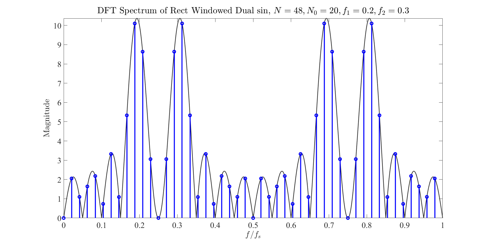

<center style="color:#C0C0C0">Figure 12. 双音信号的DFT频谱</center>

Figure 12很符合我们的预期, 因为很明显它相对于figure 8只是把两个Dirichlet Form叠加起来. 但如果我们把两个频率改得更近一些, 像下面这样:

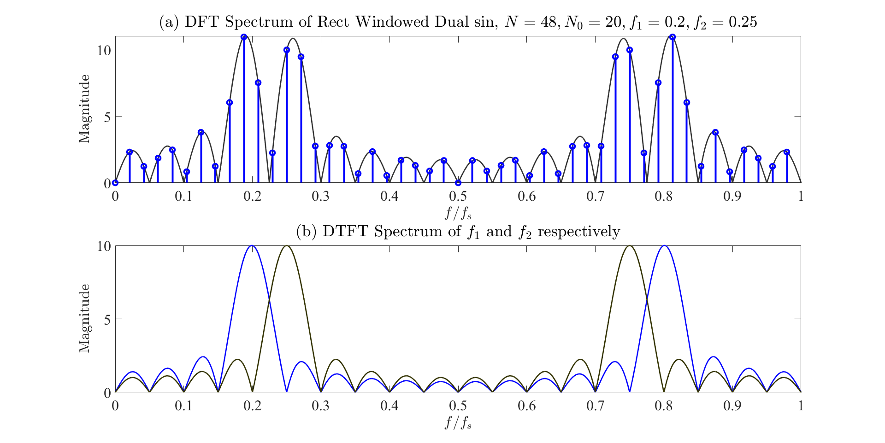

<center style="color:#C0C0C0">Figure 13. 靠得更近的双音信号的频谱以及瑞利判据示意</center>

当两个单音信号的频率靠得越来越近, 最终它们的Dirichlet Form主瓣将合在一起, DFT采样之后就无法分辨. 连续域中分辨两个不同频率的单音信号非常简单, 但离散域中由于我们只采了有限个样, 得到的信息有限, 所以会产生上述分辨率的问题. 为了准确量化我们通过DFT可分辨的最小频率区别$\Delta f$, 或称频谱分辨率, 我们借用光学分辨率的定义, 瑞利判据(Rayreigh Criterion): **两个相等强度的点光源，其中一个的中央极大值，刚好落在另一个的第一极小值**, 如figure 13(b)所示, 定义这时两临近主瓣对应的频率差是分辨它们所需要的最小频率差别, 如果靠得更近的话, 认为两个主瓣将会合并成一个大主瓣, DFT采样后无法分辨. 

根据以上定义, 由于Dirichlet Form的主瓣宽度为$2/N_0$, 旁瓣宽度为$1/N_0$, 立即得到离散域频谱最小分辨率
$$
\Delta f=1/N_0
$$
或换成连续域和采样率$f_s$相关的频率:
$$
\Delta f=\frac{f_s}{N_0}=\frac{1}{t_{tot}}
$$
固定采样频率时, 采样点越多, 总采样时间越长, Dirichlet Form越接近理想情况下的冲激函数(主瓣越窄越高, 旁瓣相对越低), 频谱分辨率越高. 固定采样点数, 只增大采样频率, 采样更快了, 但分辨率反而下降了? 这是因为$0\sim f_s$总共被划分为$N_0$份, 只增大$f_s$自然使得$\Delta f$间距增大. 或者换一种不太严谨的说法, 无论如何我们持有的有效信息只是$N_0$个点所含的全部信息, 增大$f_s$将会使得这$N_0$个点均摊到$f_s$频带的平均信息减小.

另外, 从频谱图就能看出来, 使用Zero Padding增大DFT的点数$N$对于增大频谱分辨率没有任何帮助, 因为DTFT频谱不会发生任何改变, 即主瓣之间的重叠情况不会发生任何改变. 因此$\Delta f$只和$N_0$有关, 和$N$无关.

### 其他窗函数

以上讨论的一直都是矩形窗调制的单频信号和对应的Dirichlet Form频谱. 矩形窗调制时, 如果我们能精确控制系统的输入和输出, 比如用信号发生器生成ADC的输入, 使得$f_{sig} = \frac{k}{N}f_s$, 那么$f_{har} = \frac{k\cdot h}{N}f_s$, DFT对输出信号和谐波的DTFT采样点会落在Dirichlet Form的零点, 信号峰值和谐波峰值处, 则完全不会发生频谱泄漏. 但如果是不限制输入信号的情况, 我们就需要对原本的Dirichlet Form进行一些处理, 增大主瓣和旁瓣的高度差, 即使采样点不能落在零点和峰值处, 信号截断造成的频域旁瓣对频谱的影响也会减小. 

#### 例1: Hann Window

长度为$L=N+1$的海宁窗(Hann Window)可以表示为
$$
w[n]=\frac{1}{2}\left[1-\cos (2\pi \frac{n}{N})\right], \ 0\leq n \leq N
$$
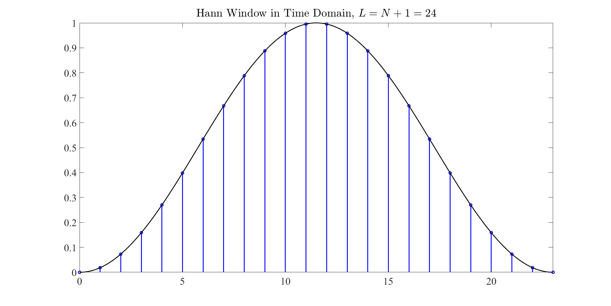

<center style="color:#C0C0C0">Figure 14. 时域的海宁窗, L=24</center>

第一眼看上去的直觉, 海宁窗可能确实对频谱泄漏有帮助, 因为从figure 10考虑, 海宁窗在信号被截断的两侧衰减了信号, 所以DFT周期性的拼接在截断处导致信号不连续, 进而产生的高频分量应该会被衰减一部分. 对海宁窗的直接分析可以复用前几节里的结果, 因为它可以表示为
$$
w[n]=\frac{1}{2}\left[1-\cos (2\pi \frac{n}{L-1})\right]\cdot p[n]\\
\begin{equation}
p[n]=\left\{
\begin{array}{cl}
1, & 0\leq n \leq L-1\\
0, & n<0\ or \ n\geq L
\end{array}
\right.
\end{equation}
$$
正好是我们之前一直在分析的矩形窗整形过的正弦信号. 矩形窗$p[n]$的DTFT是Dirichlet Form乘上对应相位因子; $\frac{1}{2}[1-\cos (2\pi \frac{n}{L-1})]$的DTFT是三个$\delta$函数之和: 
$$
\frac{1}{2}\left [1-\cos (2\pi \frac{n}{L-1})\right]\stackrel{DTFT}{\Longrightarrow}\frac{1}{2}\sum^{+\infty}_{l=-\infty}\left[ \delta(f-l)-\frac{\delta(f-\frac{1}{L-1}-l)+\delta(f+\frac{1}{L-1}-l)}{2} \right]
$$
时域相乘等效于频域周期卷积. 按照我们之前对周期卷积的理解, 取上式位于$\left[-1/2, 1/2\right]$的一个周期与$p[n]$进行非周期卷积就是$w[n]$的DTFT频谱结果. 为方便起见, 假设$\frac{1}{L-1}<\frac{1}{2}$, 即满足Nyquist采样定理, 那么$\left[-1/2, 1/2\right]$区间等效于取$l=0$. 
$$
\begin{align}
W(e^{j2\pi f})&=\frac{1}{2} \left [ \delta(f) -\frac{\delta(f -\frac{1}{L-1})+\delta(f+\frac{1}{L-1})}{2} \right ]*P(e^{j2\pi f})\\
&=\frac{1}{2}\left[ P(e^{j2\pi f}) -\frac {P\left(e^{j2\pi(f-\frac{1}{L-1})}\right)+P\left(e^{j2\pi(f+\frac{1}{L-1})}\right)}{2}\right]\\
&=\frac{1}{2} P(e^{j2\pi f})-\frac{1}{4}P\left(e^{j2\pi(f-\frac{1}{L-1})}\right)-\frac{1}{4}P\left(e^{j2\pi(f+\frac{1}{L-1})}\right)
\end{align}
$$
Hann窗的DTFT频谱如下所示:

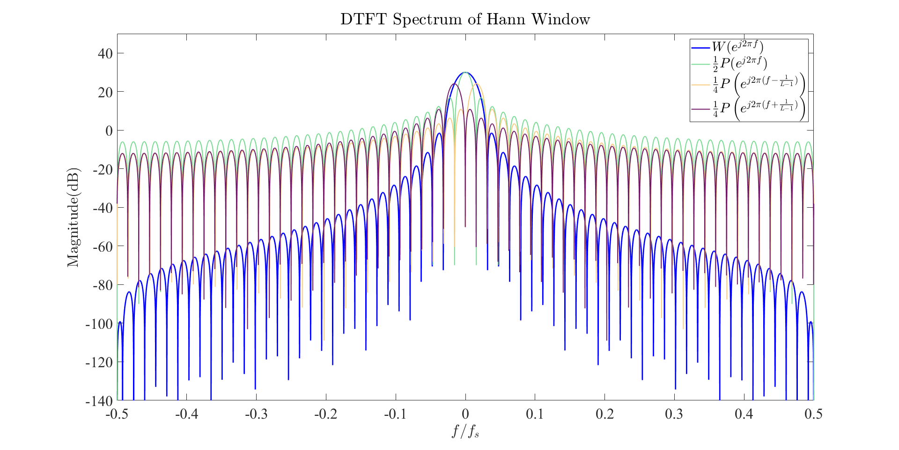

<center style="color:#C0C0C0">Figure 15. DTFT频域的海宁窗, L=64</center>

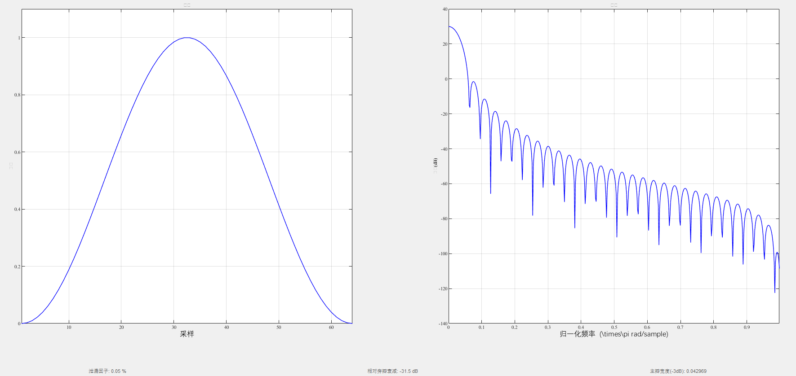

<center style="color:#C0C0C0">Figure 16. wvtool工具直接画出的海宁窗DTFT频谱, L=64, 和figure 15中完全一致</center>

```matlab
L = 64;
x = linspace(-0.5, 0.5, 100000);
W1 =    0.5*L*diric(2*pi*(x), L) .* (exp(-1i*2*pi*(x)*(L - 1)/2));
W2 =    0.25*L*diric(2*pi*(x - (1/(L-1))), L) .* (exp(-1i*2*pi*(x - (1/(L-1)))*(L - 1)/2));
W3 =    0.25*L*diric(2*pi*(x + (1/(L-1))), L) .* (exp(-1i*2*pi*(x + (1/(L-1)))*(L - 1)/2));
W =     W1 - W2 - W3;
%或更直白一些, 用MATLAB的fft函数计算DFT频谱
plot(x, 20*log10(abs(W)));
hold on;
plot(x, 20*log10(abs(W1)), Color="#76da91", LineWidth=1.5);
plot(x, 20*log10(abs(W2)), Color="#f8cb7f", LineWidth=1.5);
plot(x, 20*log10(abs(W3)), Color="#701866", LineWidth=1.5);
hold off;
axis([-0.5 0.5 -140 50]);
ylabel("Magnitude(dB)");xlabel("$f/f_s$")
legend("$W(e^{j2\pi f})$", "$\frac{1}{2} P(e^{j2\pi f})$", "$\frac{1}{4}P\left(e^{j2\pi(f-\frac{1}{L-1})}\right)$", "$\frac{1}{4}P\left(e^{j2\pi(f+\frac{1}{L-1})}\right)$", Interpreter="latex");
title("DTFT Spectrum of Hann Window");
```

浅绿色线代表矩形窗的Dirichlet Form, Hann Window就是由三个Dirichlet Form平移叠加形成的. 按照Dirichlet Form的公式, 主瓣峰值约等于$L/2=32$, 符合图中的结果. 通过调整平移距离大小和这三个子Dirichlet Form的峰值大小, 可以使得叠加后它们的旁瓣相互消去一部分, 代价是主瓣宽度增大一倍. 用$W(e^{j2\pi f})$代替矩形窗的$P(e^{j2\pi f})$, 代回之前讨论的DFT过程——**Hann窗减小了旁瓣高度(第一旁瓣相对主瓣衰减&旁瓣滚降率), 减小频谱泄漏的影响, 但主瓣宽度加倍, 频谱分辨率减半.** 

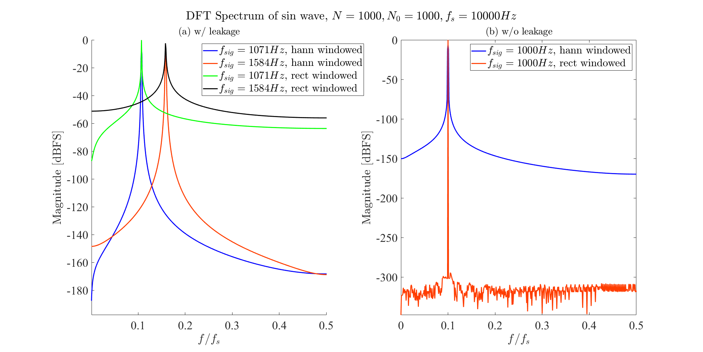

<center style="color:#C0C0C0">Figure 17. 矩形窗和Hann窗效果对比 (figure 7)</center>

Figure17中本来加矩形窗时不会发生频谱泄漏的情形, 在加Hann窗时却发生了泄漏, 是因为Hann窗叠加了几个Dirichlet Form导致零点发生了变化, DFT不能像矩形窗时那样正好落在所有峰值和零点位置. 但对于其他任意频率的$\sin$信号, 在距离信号频率稍远处, 对矩形窗频谱泄漏的抑制可以达到80dB左右.

#### 例2: Hamming Window

Hamming窗和Hann窗属于相同类型, 只是三个平移叠加的Dirichlet Form系数不同.
$$
w_{hamming}[n]=0.54-0.46\cos (2\pi \frac{n}{N}), \ 0\leq n \leq N
$$
根据上式略改一下figure 15对应的代码, 得到Hamming窗的DTFT频谱:

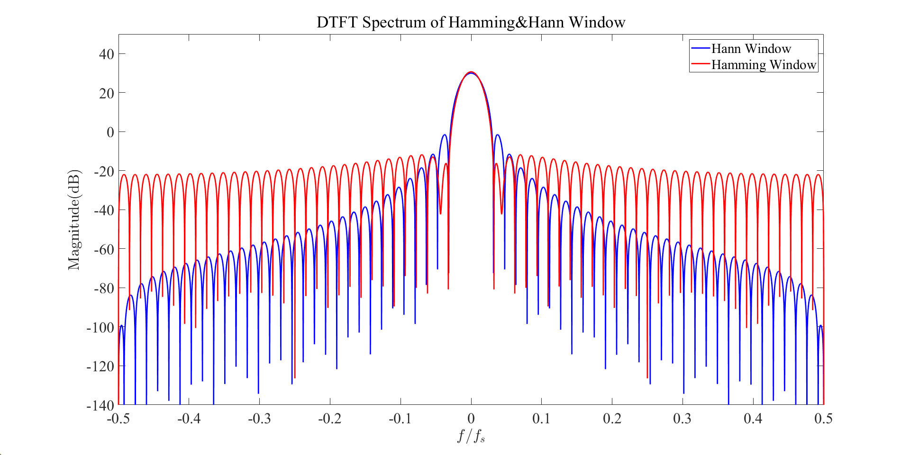

<center style="color:#C0C0C0">Figure 18. Hann和Hamming窗DTFT对比</center>

Hamming窗的第一旁瓣幅度小于Hann窗, 主瓣宽度略小于Hann窗, 但旁瓣滚降率不如Hann窗.

Blackman窗, Bartlett窗(三角窗), Kaiser窗等等的分析都类似, 它们的DTFT频谱具有不同的性质, 需要根据信号处理的要求选择. 对随机/未知信号, Hann窗是一个不错的选择, 因为它兼顾了旁瓣衰减, 旁瓣滚降和主瓣宽度.

### 总结——如何减小频谱泄露？

1. 简单粗暴的方法: 增加采样点数目. 采样点越多, 矩形窗越长, 越接近无限长dc信号, 其频谱越接近冲激信号. 主瓣的峰值随采样点数增大而增大, 但旁瓣高度变化相对小, 所以频谱泄漏相对减小.

   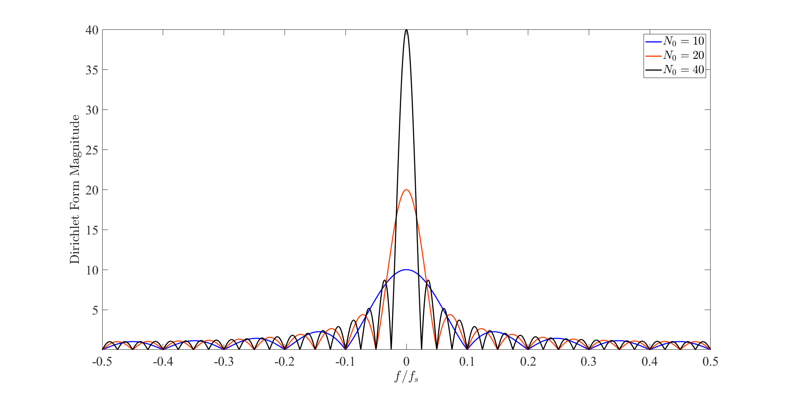

   <center style="color:#C0C0C0">Figure 19. 不同长度矩形窗对应Dirichlet Form的对比</center>

2. 如果电路仿真速度可能导致很大的采样点数目不现实. 如果能给出精确频率的输入信号, 则将输入信号频率设置为$f_{sig} = \frac{k}{N}f_s$($N$为采样点数目, $f_s$为采样频率, $k$为正整数, 无zero padding), 从理论上杜绝频谱泄漏. 为了防止产生周期性, 不够随机的量化噪声, $k$, $N$应该取为互质的整数(第8节).

3. 如果输入信号是随机/未知的, 可以增大采样点数+加窗, 尽量减小频谱泄漏至对结果无明显影响.

## 8. 噪声

噪声是一个随机过程, 噪声的瞬时幅值特性无法预测, 随机噪声信号的傅里叶变换也是一个随机信号, 其性质应该用平均功率衡量. 根据Parseval定理, 一定带宽内噪声的总功率应等于每个frequency bin中噪声功率之和. 回忆第1节中关于采样定理和第5节关于量化噪声的内容, 量化噪声因为采样和混叠在$-f_s/2\sim f_s/2$(这里及之后讨论的都是DTFT/DFT)之间形成了近似均匀的白噪声频谱. 由于混叠, 在这个频率范围内, 量化噪声的功率等于时域时我们计算出的总功率$\Delta^2/12$. 热噪声中频率超出$f_s/2$的部分(如果还未被系统本身的带宽衰减)同样会因为采样和混叠的原因回到DTFT的$-f_s/2\sim f_s/2$范围. 因此, ADC最总的FFT测试结果将会包含量化噪声, 热噪声以及其他干扰组成的噪声基底. 对于Nyquist ADC, 噪声基底一般是白噪声的形式.

无论我们在对ADC输出数据进行频谱分析的时候取了多少个采样点(即采样总时间), 噪声平均功率和信号功率都应该是不变的. 但随着采样点$N$的增大, frequency bin的数目在不断增大, 我们可以推断此时每个frequency bin分到的噪声功率也在不断减小, 否则总噪声功率不能维持不变. 从另一个角度来看, 随着$N$的增大, 矩形窗的Dirichlet form的峰值也在不断增大(峰值等于$N$), 归一化使得其他frequency bin中的分量都被除以$N$(对单频正弦信号来说, 应该是除以$N/2$, 因为单频信号将Dirichlet form拆成$\pm f_{sig}$两部分, 每个的幅度为$N/2$, 若只取半边频谱, 归一化除以$N/2$, 正如figure 9对应的代码), 噪声基底看起来就会降低. 我们可以计算$N$对单频输出信号频谱的噪声本底的定量影响:
$$
\begin{align}
SNR&=\frac{(signal \ power)}{\sum (noise \ power)}\\
&\approx \frac{(signal \ bin)^2 \times 2 }{N \cdot (noise \ floor)^2}
\end{align}
$$
注意$N$是整个$-f_s/2\sim f_s/2$频率范围内的bin数目, 由于对称性这个范围内有两个signal bin, 这正是上面一段论述过的. 或只考虑一半的频谱:
$$
SNR= \frac{(signal \ bin)^2  }{N/2 \cdot (noise \ floor)^2}
$$
写成dB的形式:
$$
\begin{align}
SNR&=10lg\left( \frac{(signal \ bin)^2  }{N/2 \cdot (noise \ floor)^2}\right)\\
&=20lg\left( \frac{signal \ bin  }{ noise \ floor}\right)-10lg\left(\frac{N}{2}\right)\\
\end{align}
$$
所以噪声本底为
$$
\begin{align}
N_{floor}&=20lg(noise \ floor)\\
&=20lg(signal\ bin)-SNR-10lg\left(\frac{N}{2}\right)\\
&=-SNR-10lg\left(\frac{N}{2}\right)
\end{align}
$$
注意在归一化之后$20lg(signal\ bin)=0$, 因为信号的谱线高度被归一化到1. 由于SNR不随着$N$的改变而改变, 这意味着$N$每增大2倍, 频谱上显示的噪声本底将降低$3dB$. 如果只考虑量化噪声, $N_{floor}$的计算公式可以写为
$$
\begin{align}
N_{floor}&=-SQNR-10lg\left(\frac{N}{2}\right)\\
&=-10lg\left( \frac{\frac{1}{2}\left(\frac{V_{FS}}{2}\right)^2}{\frac{1}{12}\left(\frac{V_{FS}}{2^B}\right)^2}\right)-10lg\left(\frac{N}{2}\right)\\
&=-(6.02\cdot B+1.76)-10lg\left(\frac{N}{2}\right)
\end{align}
$$
例如, 取ADC分辨率$B=10$, 采样点数目$N=2048$, 则$N_{floor}=-61.9dBc-30.1dB=-92dBc$.

用下面这个模拟生成的ADC输出数据为例子:

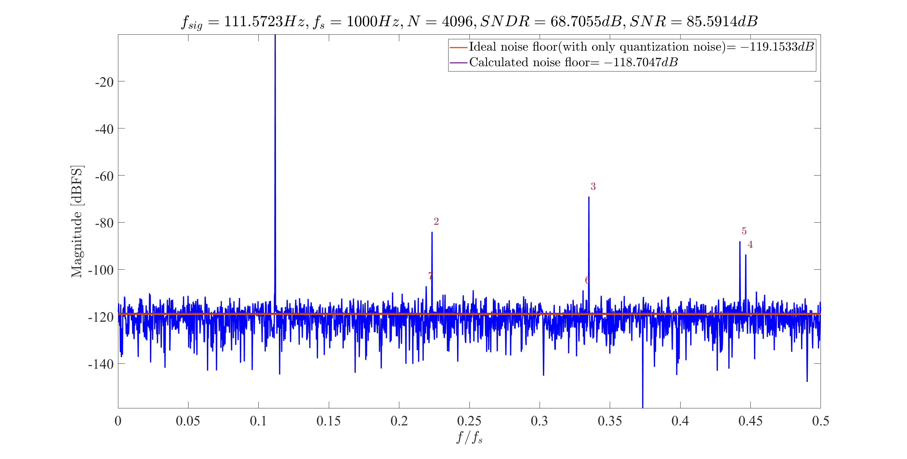

<center style="color:#C0C0C0">Figure 20. 4096 point FFT</center>

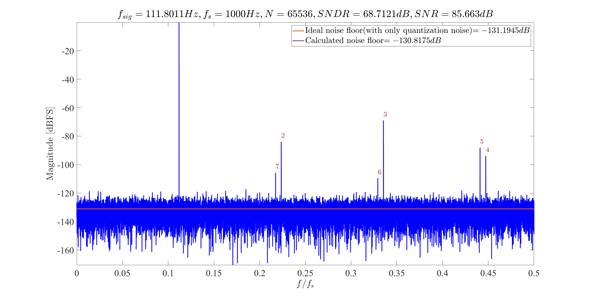

<center style="color:#C0C0C0">Figure 21. 65536 point FFT</center>

代码中人为向单频信号中加入了量化噪声, 热噪声以及谐波, 用来模拟真实的ADC输出信号. 随着采样点数$N$的增大, 正如之前预测的那样, 噪声本底降低. 采样点数增大$2^4$倍(4096->65536), 噪底降低$4\times 3dB=12dB$, 和直接计算的结果非常接近. 需要注意的是, 谐波并不会像噪底那样随着采样点数的增大而减小(尽管高阶谐波, 比如fig.20中的6阶7阶已经快要淹没在噪底中), 因为**它们都是确定的, 而非随机的信号!!** 那么显然对一个确定频率的正弦波, 无论取多少个采样点, 频谱图上对应谱线高度都不会发生变化(尽管它的高度可能非常小). 如果想要确定一个淹没在噪底中的谐波信号大小, 可以增大采样点数使噪底降低, 并根据采样点数翻倍, 噪底降低$3dB$来估计需要多少个采样点. Fig.21中, 噪底相对fig.20降低了$12dB$, 这使得我们可以清晰地分辨出6阶和7阶谐波的谱线. 注意, 由于混叠, 这些谐波可能出现在$0\sim f_s/2$区间的任何位置. 

此外, 还有一件值得注意的事: 我们一直在关注量化噪声和它形成的噪底. 热噪声(随机噪声)呢? 以代码中人为添加的随机噪声为例, 其随机分布范围为$-0.15LSB \sim 0.15LSB$, 所以它的方差(或者说功率)为$(0.3LSB)^2/12$, 和计算量化噪声功率的过程完全一样. 因为随机噪声和量化噪声不相关, 它们之间可以直接功率相加, 这意味着噪声的总功率变为原来的1.09倍, 换算成$dB$就是$10lg1.09\approx 0.374dB$, 噪底将会增加$0.374dB$, 和fig.20, fig.21图中的理想噪底(只计入量化噪声)与实际噪底之差也非常吻合. 同时, 这也说明在ADC设计中应如何设计噪声预算, 随机分布范围大小为$0.3LSB$的热噪声对SNR的影响已经比较小.

```matlab

% MATLAB code modified from Prof. Murmann EE315b
N = 2048*32;                    % N sample points
cycles = 229*32-1;              
fs = 1000;                      % sample rate
fx = fs*cycles/N;               % signal freq
Res = 14;                       % ADC resolution
LSB = 2/2^Res;                  % signal full scale = 2

x = cos(2*pi*fx/fs*[0:N-1]);    % sample, signal full scale = 2
                                % manually add harmonics
phase = -1*pi+2*pi*[0.1190    0.4984    0.9597    0.3404    0.5853    0.2238];
amp = [0.1^4.2    0.1^3.45    0.1^4.7    0.1^4.4    0.1^5.5    0.1^5.3];
for i = 2:7
    x = x + amp(i-1)*cos(2*pi*fx*i/fs*[0:N-1] + phase(i-1));
end
x = x + 0.3*LSB*(rand(1,N)-0.5);% manually add thermal noise
x_wo_q = x;                     % without quantization
x = round(x/LSB)*LSB;           % mid-tread quantization

s = abs(fft(x));
s = s(1:end/2)/(N/2);

s_wo_q = abs(fft(x_wo_q));
s_wo_q = s_wo_q(1:end/2)/(N/2);

sigbin = 1 + cycles;            % note that matlab fft output vector index starts with 1, rather than 0 in previous formulae
harmonics = mod(cycles*(2:7), N);% calculate harmonic position after aliasing
noisebin = [];
for i = 1:6
    if harmonics(i) >= N/2
        harmonics(i) = N - harmonics(i);
    end
end
harmonics = harmonics + 1;
harmonics_0 = [0, sigbin, harmonics, N/2+1]
harmonics = sort(harmonics_0);
for i = 1:8
    noisebin = [noisebin, ((harmonics(i)+1) : (harmonics(i+1)-1))];
end
noise = s(noisebin);
noisedistor = [s(1:sigbin-1), s(sigbin+1:end)];         
snr = 10*log10((s(sigbin))^2/(sum(noise.^2)));          % SNR
sndr = 10*log10((s(sigbin))^2/(sum(noisedistor.^2)));   % SNDR

s = 20*log10(s);
s_wo_q = 20*log10(s_wo_q);

plot(linspace(1/N, 1/2, N/2), s);
hold on;
%plot(linspace(1/N, 1/2, N/2), s_wo_q);
axis([0 1/2 -inf inf]);
ylabel("Magnitude [dBFS]");
xlabel("$f/f_s$");
title("$f_{sig}=" +num2str(fs*cycles/N)+"Hz, f_s="+num2str(fs)+"Hz,N="+num2str(N)+",SNDR="+num2str(sndr)+"dB,SNR="+num2str(snr)+"dB$");
for i = 1:6
    text((harmonics_0(i+2)+5)/N, s(harmonics_0(i+2))+4, num2str(i+1),'FontSize',18, 'Color','#A2142F');
end
Nfloor_ideal = -(Res*6.02+1.76)-10*log10(N/2)*ones(1, N/2);    % Noise floor(without thermal noise)
Nfloor_cal = -snr-10*log10(N/2)*ones(1, N/2);                  % Noise floor(with thermal noise)
plot(linspace(1/N, 1/2, N/2), Nfloor_ideal);
plot(linspace(1/N, 1/2, N/2), Nfloor_cal);
str = ["";"Ideal noise floor(with only quantization noise)$="+num2str(Nfloor_ideal(1))+"dB$";"Calculated noise floor$="+num2str(Nfloor_cal(1))+"dB$"];
legend(str, interpreter="latex");
% hold off;
```


然而, 量化噪声有时可能会呈现理想假设之外的性质. 对单频输入信号, 为了防止频谱泄漏, 一般取$f_{sig}=\frac{k}{N}f_{s}$. 但如果$k$和$N$选取不合理, 例如像下图中$k/N=8$, 此时量化噪声呈现出一种特定的范式, 并具有明显的周期性, 这不符合我们关于量化噪声是白噪声的假设. 

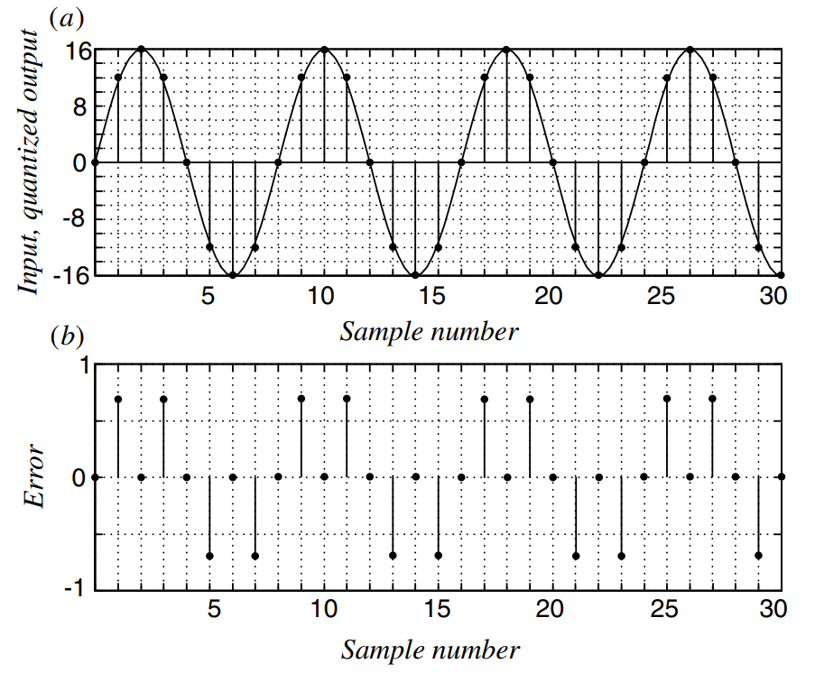

<center style="color:#C0C0C0"> Figure 22. A f=fs/8 sine wave sampled and quantized at fs, Understanding delta-sigma data converters p34</center>

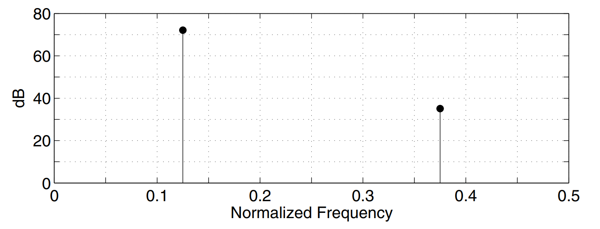

<center style="color:#C0C0C0"> Figure 23. A 256-point FFT of the quantized sine wave of Figure 22, Understanding delta-sigma data converters p34</center>

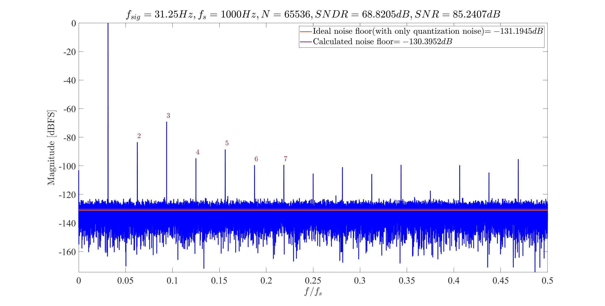

<center style="color:#C0C0C0"> Figure 24. Another example with many undesirable peaks, generated from fig20/21 code, N=65536, k=2048. Note that harmonics are higher than in fig.20 and fig.21,because there are strong quantization noise components at harmonic frequency bins</center>

实际上量化噪声的这种性质可以由$f_{sig}=\frac{k}{N}f_{s}$来预测, 即
$$
kT_{sig}=NT_s
$$
从这个式子中我们容易看出, 从$t=0$开始采样, 每经过$kT_{sig}=NT_s$时间, 采样点和正弦信号的相位(或者说相对位置)就会回到$t=0$的状态. 例如, $t=0$时恰好采样到正弦信号的正的峰值, 那么$t=NT_s,2NT_s,3NT_s,\cdots$时都必然有采样点落到正弦信号的正的峰值. 所以说, 如果按照$f_{sig}=\frac{k}{N}f_{s}$进行设置, 那么输出信号的量化噪声一定会有周期性. 更糟的是, 如果$k$和$N$有不为1的最大公约数, 那么上式还会简化为
$$
(k/l)T_{sig}=(N/l)T_s
$$
这意味着量化噪声的周期更短了(Fig.22中, 量化噪声的周期只有$8T_s$), 那么它所包含的频率成分可能更加简单, 更加偏离白噪声的假设. 或者说, 对于$N$个点的采样, 每个点产生一个量化噪声$Q[n]$, 那么$k$和$N$存在公约数$l$时, 实际上$N$个点的量化噪声信息中只有$1/l$是未重复的(量化噪声的周期是$N/l$). 从"均匀采集量化噪声"的角度看, 这么一次$N$点的采样, 实际效果只相当于一次$N/l$点的采样. 为了避免信息的浪费和无用功, 使量化噪声更加均匀, 尽可能包含多的频率成分, 更加接近白噪声, 按照上面的分析, 应当使得$k$和$N$最大公约数为1, 从而使得单频信号的量化噪声的周期最大. 下图给出了一个例子, 以和上面进行对比.

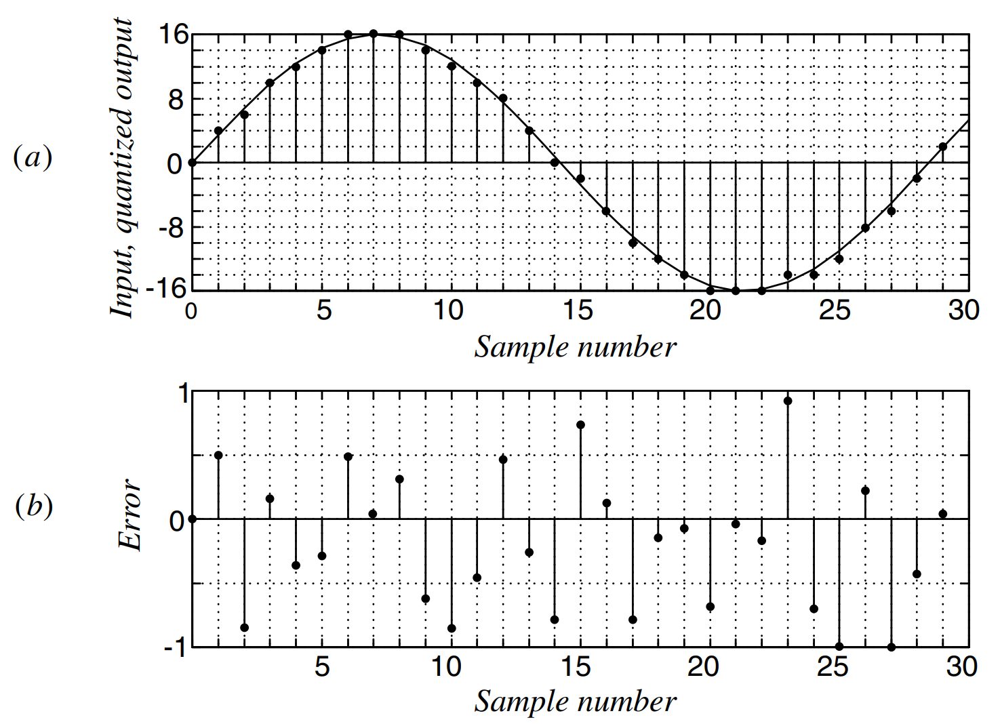

<center style="color:#C0C0C0"> Figure 25. Another quantized sine wave, but has a longer quantization error period, Understanding delta-sigma data converters p33</center>

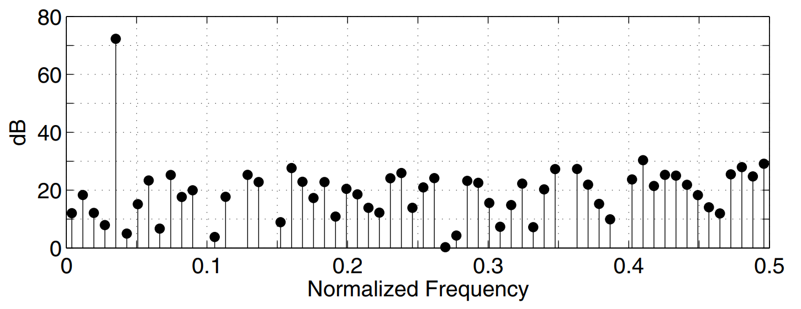

<center style="color:#C0C0C0"> Figure 26. A 256-point FFT of the quantized sine wave of Figure 25, Understanding delta-sigma data converters p33</center>
